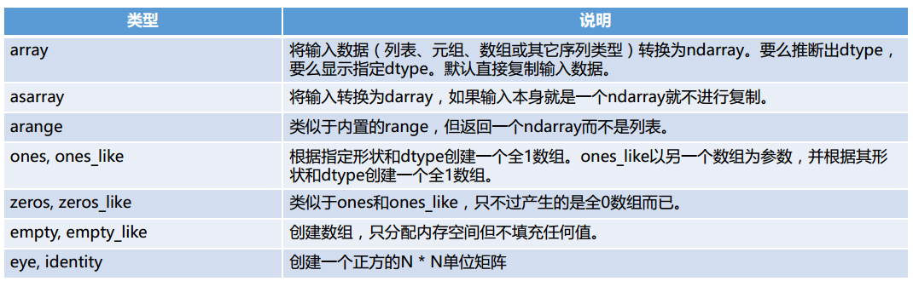
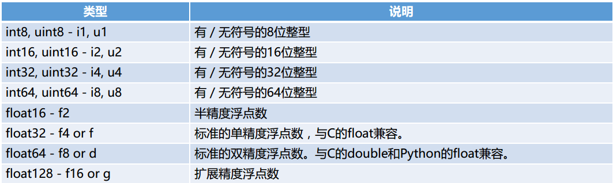
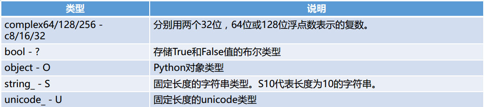

## python 基础

### Anaconda 安装

* [下载地址](https://www.continuum.io/downloads)

* 命令行创建和启动

  `conda create --name py27 python=2.7`

  `activate py27`

* 列出安装的包 `conda list` `conda list -n py27`

* 安装新包 `conda install numpy` （会安装和更新库所依赖的各种库）

* 删除包 `conda remove requests`

* 更新包 `conda update numpy`

* 上述命令 可以通过 -n 指定环境，或者默认当前使用的环境

* 设置国内镜像

  ```python
  # 添加Anaconda的TUNA镜像
  conda config --add channels https://mirrors.tuna.tsinghua.edu.cn/anaconda/pkgs/free/
   
  # 设置搜索时显示通道地址
  conda config --set show_channel_urls yes
  ```

  ​

### 安装一些依赖

```python
conda install ipython
conda install jupyter
conda install numpy
conda install scipy
conda install pandas
conda install matplotlib
```

### Numpy

提供常用的数值数组、矩阵等函数

优点：

*   基于向量化的运算

*   进行数值运算时Numpy数组比list效率高

*   可以直接对数组的每个元素进行操作

    ```python
    In [1]: import numpy as np

    In [2]: np.arange(10)
    Out[2]: array([0, 1, 2, 3, 4, 5, 6, 7, 8, 9])

    In [3]: a = _

    In [4]: a ** 2
    Out[4]: array([ 0,  1,  4,  9, 16, 25, 36, 49, 64, 81])
    ```

    ​

### Scipy

是一种使用numpy来做高等数学、信号处理、优化、统计的扩展包

* Linear Algebra (scipy.linalg)  线性代数

* Statistics (scipy.stats) 统计

* Spatial data structure and algorithms (scipy.spatial) 空间的数据结构和算法

  ```python
  In [5]: from scipy import linalg

  In [6]: A = np.array([[1,2],[3,4]])

  In [7]: A
  Out[7]:
  array([[1, 2],
         [3, 4]])

  In [8]: linalg.det(A)
  Out[8]: -2.0
  ```

  ​

### Pandas

一种基于numpy的高级数据结构和精巧工具，快速简单的处理数据

数据结构：Series和DataFrame

```python
In [9]: import pandas as pd

In [10]: s = pd.Series([1,3,5,np.nan,6,8])

In [11]: s
Out[11]:
0    1.0
1    3.0
2    5.0
3    NaN
4    6.0
5    8.0
dtype: float64

In [12]: dates = pd.date_range("20170101", periods=6)

In [13]: dates
Out[13]:
DatetimeIndex(['2017-01-01', '2017-01-02', '2017-01-03', '2017-01-04',
               '2017-01-05', '2017-01-06'],
              dtype='datetime64[ns]', freq='D')

In [15]: df = pd.DataFrame(np.random.randn(6,4), index=dates, columns=list("ABCD"))

In [16]: df
Out[16]:
                   A         B         C         D
2017-01-01  0.566986  1.496505 -0.581817 -0.871785
2017-01-02 -1.124203  0.062415 -0.299159  0.196818
2017-01-03  1.487586 -0.617459  1.742232  1.907163
2017-01-04 -1.366047 -0.601547  1.337706 -1.475740
2017-01-05  1.701493  1.312726  0.394726  0.400058
2017-01-06  0.443797  0.852563  1.315806 -1.041364

In [19]: df.describe()  # 描述
Out[19]:
              A         B         C         D
count  6.000000  6.000000  6.000000  6.000000
mean   0.284935  0.417534  0.651582 -0.147475
std    1.286018  0.937085  0.958398  1.243207
min   -1.366047 -0.617459 -0.581817 -1.475740
25%   -0.732203 -0.435557 -0.125688 -0.998969
50%    0.505392  0.457489  0.855266 -0.337483
75%    1.257436  1.197685  1.332231  0.349248
max    1.701493  1.496505  1.742232  1.907163

In [20]: df.T  # 转置
Out[20]:
   2017-01-01  2017-01-02  2017-01-03  2017-01-04  2017-01-05  2017-01-06
A    0.566986   -1.124203    1.487586   -1.366047    1.701493    0.443797
B    1.496505    0.062415   -0.617459   -0.601547    1.312726    0.852563
C   -0.581817   -0.299159    1.742232    1.337706    0.394726    1.315806
D   -0.871785    0.196818    1.907163   -1.475740    0.400058   -1.041364

In [21]: df.sort_values(by="B")  # p排序
Out[21]:
                   A         B         C         D
2017-01-03  1.487586 -0.617459  1.742232  1.907163
2017-01-04 -1.366047 -0.601547  1.337706 -1.475740
2017-01-02 -1.124203  0.062415 -0.299159  0.196818
2017-01-06  0.443797  0.852563  1.315806 -1.041364
2017-01-05  1.701493  1.312726  0.394726  0.400058
2017-01-01  0.566986  1.496505 -0.581817 -0.871785
```


### matplotlib

python 的绘图库

```python
In [1]: import matplotlib.pyplot as plt

In [2]: plt.plot([1,2,3])
Out[2]: [<matplotlib.lines.Line2D at 0x68f82b0>]

In [3]: plt.ylabel("some numebers")
Out[3]: <matplotlib.text.Text at 0x67f5208>

In [4]: plt.show()
```


### nltk

自然语言处理工具包

```python
安装：pip install nltk
引入：import nltk
下载语料库： nltk.download()
```


应用：

* 文本提取
* 词汇切分
* 词频分析
* 词袋模型
* 情感分析


### igraph

图计算和社交网络分析

安装：

```python
pip install -U python-igraph
conda install -c marufr python-igraph=0.7.1.post6
或者
下载 http://www.lfd.uci.edu/~gohlke/pythonlibs/#python-igraph
python_igraph-0.7.1.post6-cp27-none-win_amd64.whl
pip install python_igraph-0.7.1.post6-cp27-none-win_amd64.whl
```

### Scikit-learn

是建立在scipy之上的一个用于机器学习的python模块

安装

```python
pip install -U scikit-learn
conda install scikit-learn
```


## Numpy

Numpy是python的一个扩展库。支持高级大量的维度与矩阵运算，此外也针对数组运算提供大量的数学函数库。

基本功能介绍：

* 快速高效的多维数组对象ndarray
* 用于对数组执行元素级计算以及直接对数组执行数学运算的函数
* 用于读写硬盘上基于数组的数据集工具
* 线性代数运算、傅里叶变换、随机数生成
* 用于将C、C++、Fortran代码集成到python的工具
* 作为算法之间的传递数据的容器


效率对比，以求和为例：

* 使用numpy.array 结构，并使用numpy.sum 函数效率最高
* 使用list和array结构的时候，使用python的sum效率要搞


### ndarry

一种N维数组对象，该对象是一个快速而灵活的大数据集容器。

每个数组都有一个shape（一个代表各维度大小的元组）和一个dtype（说明数据类型对象）

### 创建ndarray



```python
In [47]: alist = range(10)
In [48]: arr = np.array(alist); arr, arr.dtype, arr.shape
Out[48]: (array([0, 1, 2, 3, 4, 5, 6, 7, 8, 9]), dtype('int32'), (10L,))
    
In [49]: data = [[1, 2, 3, 4], [5, 6, 7, 8]]

In [50]: arr2 = np.array(data);arr2, arr2.dtype, arr2.shape
Out[50]:
(array([[1, 2, 3, 4],
        [5, 6, 7, 8]]), dtype('int32'), (2L, 4L))

In [51]: np.zeros(10)
Out[51]: array([ 0.,  0.,  0.,  0.,  0.,  0.,  0.,  0.,  0.,  0.])

In [52]: np.zeros((2,4))
Out[52]:
array([[ 0.,  0.,  0.,  0.],
       [ 0.,  0.,  0.,  0.]])

In [53]: np.empty((2,3,2))
Out[53]:
array([[[ 0.,  0.],
        [ 0.,  0.],
        [ 0.,  0.]],

       [[ 0.,  0.],
        [ 0.,  0.],
        [ 0.,  0.]]])
```

注意：np.empty 里面仅仅是占位，元素没有初始化。

### numpy的数据类型





* 创建ndarray时指定dtype类型

* 使用astype显示转换类型，astype进行了复制，原数组不变

  ```python
  In [54]: arr = np.array([1, 2, 3], dtype = np.float64); arr.dtype
  Out[54]: dtype('float64')

  In [55]: arr = np.array([1, 2, 3], dtype = np.int32); arr.dtype
  Out[55]: dtype('int32')

  In [57]: int_arr = np.array([1, 2, 3, 4, 5]); int_arr.dtype
  Out[57]: dtype('int32')

  In [58]: float_arr = int_arr.astype(np.float); float_arr.dtype
  Out[58]: dtype('float64')

  ```

  ​

### ndarray数组与标量之间的运算

* 不用编写循环即可对数据执行批量运算

* 大小相等的数组之间的任何算术运算都会将运算应用到元素级

* 数组与标量的算术运算也会将那个标量的值传播到各个元素

  ```python
  In [62]: arr = np.array([[1.0, 2.0, 3.0], [4., 5., 6.]])

  In [63]: arr * arr
  Out[63]:
  array([[  1.,   4.,   9.],
         [ 16.,  25.,  36.]])

  In [64]: arr - arr
  Out[64]:
  array([[ 0.,  0.,  0.],
         [ 0.,  0.,  0.]])

  In [65]: 1/arr
  Out[65]:
  array([[ 1.        ,  0.5       ,  0.33333333],
         [ 0.25      ,  0.2       ,  0.16666667]])

  In [67]: arr**.5
  Out[67]:
  array([[ 1.        ,  1.41421356,  1.73205081],
         [ 2.        ,  2.23606798,  2.44948974]])
  ```

  ### ndarry的索引和切片

  一维数组很简单，跟python列表类似。

  当将一个标量传递给切片时，如arr[5:8] = 12，该值会自动广播到整个选区。

  ```python
  In [73]: arr = np.arange(10)

  In [75]: arr[5], arr[5:8]
  Out[75]: (5, array([5, 6, 7]))

  In [76]: arr[5:8] = 12; arr
  Out[76]: array([ 0,  1,  2,  3,  4, 12, 12, 12,  8,  9])
  ```

  跟列表的重要区别是：**数组切片是原始数组的视图，数据不会被复制，视图的任何修改都被反应到源数组上。**如果想要复制，可以显示操作`arr[5:8].copy()`

  ```python
  In [77]: arr_slice= arr[5:8]

  In [78]: arr_slice[1] = 12345

  In [79]: arr
  Out[79]: array([    0,     1,     2,     3,     4,    12, 12345,    12,     8,   9])

  In [80]: arr_slice[:] = 64

  In [81]: arr
  Out[81]: array([ 0,  1,  2,  3,  4, 64, 64, 64,  8,  9])

  ```

  在二维数组中，各个索引位置上的元素不再是标量，而是一维数组。

  可以对元素进行递归访问，也可以逗号隔开的索引选取单个元素。

  ```python
  In [88]: arr2d = np.array([[1,2,3],[4,5,6],[7,8,9]])

  In [89]: arr2d[2]
  Out[89]: array([7, 8, 9])

  In [90]: arr2d[0][2]
  Out[90]: 3

  In [91]: arr2d[0,2]
  Out[91]: 3
  ```

  在多维数组中，如果省略了后面的索引，返回对象是一个维度低一点的ndarray

  标量值和数组都可以被赋值给arr3d[0]

  ```python
  In [94]: arr3d = np.array([[[1,2,3], [4,5,6]],[[7,8,9], [10,11,12]]])

  In [95]: arr3d
  Out[95]:
  array([[[ 1,  2,  3],
          [ 4,  5,  6]],

         [[ 7,  8,  9],
          [10, 11, 12]]])

  In [96]: arr3d[0]
  Out[96]:
  array([[1, 2, 3],
         [4, 5, 6]])

  In [97]: old_values = arr3d[0].copy()

  In [98]: arr3d[0] = 42; arr3d
  Out[98]:
  array([[[42, 42, 42],
          [42, 42, 42]],

         [[ 7,  8,  9],
          [10, 11, 12]]])

  In [99]: arr3d[0] = old_values; arr3d
  Out[99]:
  array([[[ 1,  2,  3],
          [ 4,  5,  6]],

         [[ 7,  8,  9],
          [10, 11, 12]]])

  In [100]: arr3d[1, 0]
  Out[100]: array([7, 8, 9])
  ```

  **切片索引**

  切片语法跟list这样的一维对象差不多

  高纬度对象可以在一个或者多个轴上进行切片，也可以跟整数索引混合用。

  “冒号”表示选取整个轴

  ```python
  In [101]: arr2d
  Out[101]:
  array([[1, 2, 3],
         [4, 5, 6],
         [7, 8, 9]])

  In [102]: arr2d[:2]
  Out[102]:
  array([[1, 2, 3],
         [4, 5, 6]])

  In [103]: arr2d[:2, 1:]
  Out[103]:
  array([[2, 3],
         [5, 6]])

  In [104]: arr2d[:, 1]
  Out[104]: array([2, 5, 8])

  In [105]: arr2d[:, :1]
  Out[105]:
  array([[1],
         [4],
         [7]])
  ```

  **布尔型索引**

  数组的比较运算也是矢量化的 （==   !=）

  布尔型数组可以用于数组索引，要求布尔型数组的长度必须跟被索引的轴的长度一致

  布尔型数组跟切片、整数可以混合使用

  可以组合应用多个布尔条件，使用 &(和) |（或）运算即可

  通过布尔型数组设置值是一种常用手段，如将数组中所有小于0的设置为0

  ```python
  In [107]: names = np.array(["Bob", "Joe", "Will", "Bob", "Will", "Joe", "Joe"])

  In [108]: data = np.random.randn(7, 4)

  In [109]: data
  Out[109]:
  array([[ 0.7938396 , -0.64073577,  0.39437987,  0.74264878],
         [-1.06331352,  0.15099267, -1.66302807, -1.19741409],
         [-1.35491288, -1.1184129 ,  0.67225899,  0.30427689],
         [ 1.80158574,  1.68064436, -0.59577665, -0.56495864],
         [ 0.28012105,  0.10510227, -1.83661252, -0.72791189],
         [ 1.80042063, -0.83958714, -0.983758  ,  0.80808786],
         [-2.7868147 , -1.40439205, -0.38592472, -0.50612607]])

  In [110]: names == "Bob"
  Out[110]: array([ True, False, False,  True, False, False, False], dtype=bool)

  In [111]: data[names == "Bob"]
  Out[111]:
  array([[ 0.7938396 , -0.64073577,  0.39437987,  0.74264878],
         [ 1.80158574,  1.68064436, -0.59577665, -0.56495864]])

  In [112]: data[names == "Bob", 2:]
  Out[112]:
  array([[ 0.39437987,  0.74264878],
         [-0.59577665, -0.56495864]])

  In [113]: mask = (names == "Bob") | (names == "Will")

  In [114]: data[mask]
  Out[114]:
  array([[ 0.7938396 , -0.64073577,  0.39437987,  0.74264878],
         [-1.35491288, -1.1184129 ,  0.67225899,  0.30427689],
         [ 1.80158574,  1.68064436, -0.59577665, -0.56495864],
         [ 0.28012105,  0.10510227, -1.83661252, -0.72791189]])

  In [115]: data[data < 0] = 0

  In [116]: data
  Out[116]:
  array([[ 0.7938396 ,  0.        ,  0.39437987,  0.74264878],
         [ 0.        ,  0.15099267,  0.        ,  0.        ],
         [ 0.        ,  0.        ,  0.67225899,  0.30427689],
         [ 1.80158574,  1.68064436,  0.        ,  0.        ],
         [ 0.28012105,  0.10510227,  0.        ,  0.        ],
         [ 1.80042063,  0.        ,  0.        ,  0.80808786],
         [ 0.        ,  0.        ,  0.        ,  0.        ]])
  ```

  **花式索引**

  花式索引（Fancy indexing）是指利用整数数组进行索引。

  切记：花式索引跟切片不一样，总是将数据复制到新的数组中。

  一次传入多个数组，返回的是一维数组，其中的元素对应各个索引元组。

  要选取矩阵的行列子集应该使用矩形区域的形式才可以。

  ```python
  # 一个8*4的数组
  In [117]: arr = np.empty((8,4))

  In [119]: for i in range(8):
       ...:     arr[i] = i
       ...:

  In [120]: arr
  Out[120]:
  array([[ 0.,  0.,  0.,  0.],
         [ 1.,  1.,  1.,  1.],
         [ 2.,  2.,  2.,  2.],
         [ 3.,  3.,  3.,  3.],
         [ 4.,  4.,  4.,  4.],
         [ 5.,  5.,  5.,  5.],
         [ 6.,  6.,  6.,  6.],
         [ 7.,  7.,  7.,  7.]])
  # 以特定顺序选取子集
  In [121]: arr[[4,3,0,6]]
  Out[121]:
  array([[ 4.,  4.,  4.,  4.],
         [ 3.,  3.,  3.,  3.],
         [ 0.,  0.,  0.,  0.],
         [ 6.,  6.,  6.,  6.]])

  In [123]: arr = np.arange(32).reshape((8,4))

  In [124]: arr
  Out[124]:
  array([[ 0,  1,  2,  3],
         [ 4,  5,  6,  7],
         [ 8,  9, 10, 11],
         [12, 13, 14, 15],
         [16, 17, 18, 19],
         [20, 21, 22, 23],
         [24, 25, 26, 27],
         [28, 29, 30, 31]])

  In [125]: arr[[1,5,7,2],[0,3,1,2]]  # 选取(1,0) (5,3) (7,2) (2,2)位置的元素
  Out[125]: array([ 4, 23, 29, 10])
   
  # 矩形区域方式一
  In [126]: arr[[1,5,7,2]][:,[0,3,1,2]]
  Out[126]:
  array([[ 4,  7,  5,  6],
         [20, 23, 21, 22],
         [28, 31, 29, 30],
         [ 8, 11,  9, 10]])
  # 矩形区域方式二
  In [127]: arr[np.ix_([1,5,7,2],[0,3,1,2])]
  Out[127]:
  array([[ 4,  7,  5,  6],
         [20, 23, 21, 22],
         [28, 31, 29, 30],
         [ 8, 11,  9, 10]])
  ```

  ### 数组转置和轴兑换

  转置（transpose）是重塑的一种特殊形式，它返回源数据的视图。

  数组有个特殊属性T，可以进行轴兑换

  对于高维数组，转置需要得到一个由轴编号组成的元组才能对这些轴进行转置

  ndarray还有一个swapaxes方法，它需要接受一对轴编号

  swapaxes 也是返回源数据的视图

  ```python
  In [128]: arr = np.arange(15).reshape((3,5))

  In [129]: arr
  Out[129]:
  array([[ 0,  1,  2,  3,  4],
         [ 5,  6,  7,  8,  9],
         [10, 11, 12, 13, 14]])

  # 转置
  In [130]: arr.T
  Out[130]:
  array([[ 0,  5, 10],
         [ 1,  6, 11],
         [ 2,  7, 12],
         [ 3,  8, 13],
         [ 4,  9, 14]])

  # 用np.dot 计算矩阵内积
  In [131]: np.dot(arr.T, arr)
  Out[131]:
  array([[125, 140, 155, 170, 185],
         [140, 158, 176, 194, 212],
         [155, 176, 197, 218, 239],
         [170, 194, 218, 242, 266],
         [185, 212, 239, 266, 293]])
  In [132]: arr = np.arange(16).reshape((2,2,4))

  In [133]: arr
  Out[133]:
  array([[[ 0,  1,  2,  3],
          [ 4,  5,  6,  7]],

         [[ 8,  9, 10, 11],
          [12, 13, 14, 15]]])

  In [134]: arr.transpose((1,0,2))
  Out[134]:
  array([[[ 0,  1,  2,  3],
          [ 8,  9, 10, 11]],

         [[ 4,  5,  6,  7],
          [12, 13, 14, 15]]])

  In [136]: arr.swapaxes(1,2)
  Out[136]:
  array([[[ 0,  4],
          [ 1,  5],
          [ 2,  6],
          [ 3,  7]],

         [[ 8, 12],
          [ 9, 13],
          [10, 14],
          [11, 15]]])
  # 与arr.swapaxes(1,2)效果一样
  In [138]: arr.transpose((0,2,1))
  Out[138]:
  array([[[ 0,  4],
          [ 1,  5],
          [ 2,  6],
          [ 3,  7]],

         [[ 8, 12],
          [ 9, 13],
          [10, 14],
          [11, 15]]])
  ```

  ​