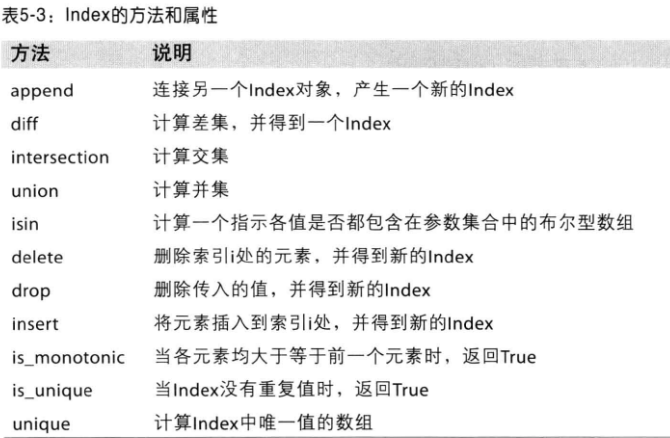
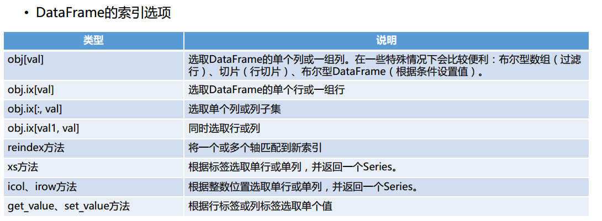
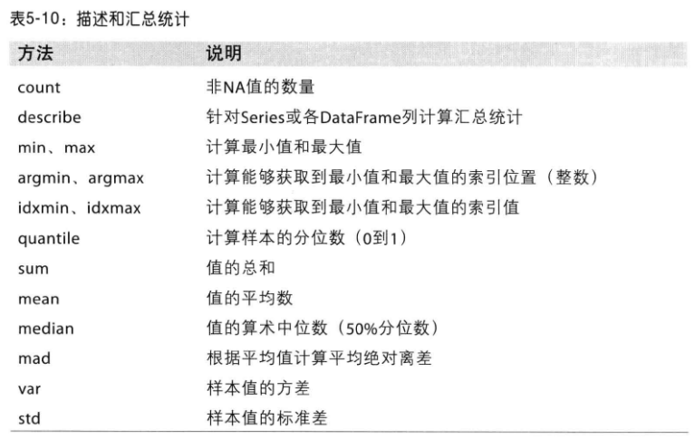
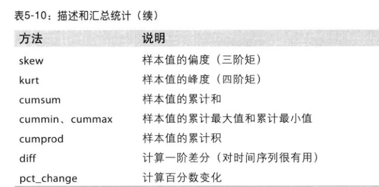
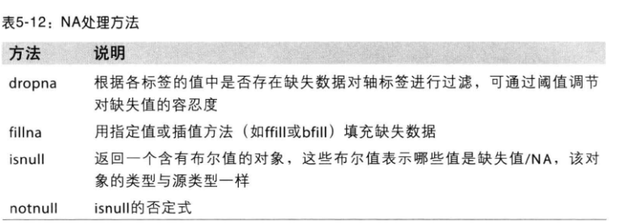

## python 基础

### Anaconda 安装

* [下载地址](https://www.continuum.io/downloads)

* 删除虚拟环境。

   使用命令conda remove -n your_env_name(虚拟环境名称) --all， 即可删除。

* 删除环境中的某个包。

   使用命令conda remove --name $your_env_name  $package_name 即可。

* 命令行创建和启动

  `conda create --name py27 python=2.7`

  `activate py27`

* 列出安装的包 `conda list` `conda list -n py27`

* conda info --envs

* 安装新包 `conda install numpy` （会安装和更新库所依赖的各种库）

* 删除包 `conda remove requests`

* 更新包 `conda update numpy`

* 上述命令 可以通过 -n 指定环境，或者默认当前使用的环境

* 设置国内镜像

  ```python
  # 添加Anaconda的TUNA镜像
  conda config --add channels https://mirrors.tuna.tsinghua.edu.cn/anaconda/pkgs/free/

  # 设置搜索时显示通道地址
  conda config --set show_channel_urls yes
  ```

  ​

### 安装一些依赖

```python
conda install ipython
conda install jupyter
conda install numpy
conda install scipy
conda install pandas
conda install matplotlib
conda install pandas-datareader
conda install --channel https://conda.anaconda.org/menpo opencv3
conda install PIL
conda install scikit-image
```

### Numpy

提供常用的数值数组、矩阵等函数

优点：

*   基于向量化的运算

*   进行数值运算时Numpy数组比list效率高

*   可以直接对数组的每个元素进行操作

    ```python
        In [1]: import numpy as np

        In [2]: np.arange(10)
        Out[2]: array([0, 1, 2, 3, 4, 5, 6, 7, 8, 9])

        In [3]: a = _

        In [4]: a ** 2
        Out[4]: array([ 0,  1,  4,  9, 16, 25, 36, 49, 64, 81])
    ```

        ​

### Scipy

是一种使用numpy来做高等数学、信号处理、优化、统计的扩展包

* Linear Algebra (scipy.linalg)  线性代数

* Statistics (scipy.stats) 统计

* Spatial data structure and algorithms (scipy.spatial) 空间的数据结构和算法

  ```python
  In [5]: from scipy import linalg

  In [6]: A = np.array([[1,2],[3,4]])

  In [7]: A
  Out[7]:
  array([[1, 2],
         [3, 4]])

  In [8]: linalg.det(A)
  Out[8]: -2.0
  ```

  ​

### Pandas

一种基于numpy的高级数据结构和精巧工具，快速简单的处理数据

数据结构：Series和DataFrame

```python
In [9]: import pandas as pd

In [10]: s = pd.Series([1,3,5,np.nan,6,8])

In [11]: s
Out[11]:
0    1.0
1    3.0
2    5.0
3    NaN
4    6.0
5    8.0
dtype: float64

In [12]: dates = pd.date_range("20170101", periods=6)

In [13]: dates
Out[13]:
DatetimeIndex(['2017-01-01', '2017-01-02', '2017-01-03', '2017-01-04',
               '2017-01-05', '2017-01-06'],
              dtype='datetime64[ns]', freq='D')

In [15]: df = pd.DataFrame(np.random.randn(6,4), index=dates, columns=list("ABCD"))

In [16]: df
Out[16]:
                   A         B         C         D
2017-01-01  0.566986  1.496505 -0.581817 -0.871785
2017-01-02 -1.124203  0.062415 -0.299159  0.196818
2017-01-03  1.487586 -0.617459  1.742232  1.907163
2017-01-04 -1.366047 -0.601547  1.337706 -1.475740
2017-01-05  1.701493  1.312726  0.394726  0.400058
2017-01-06  0.443797  0.852563  1.315806 -1.041364

In [19]: df.describe()  # 描述
Out[19]:
              A         B         C         D
count  6.000000  6.000000  6.000000  6.000000
mean   0.284935  0.417534  0.651582 -0.147475
std    1.286018  0.937085  0.958398  1.243207
min   -1.366047 -0.617459 -0.581817 -1.475740
25%   -0.732203 -0.435557 -0.125688 -0.998969
50%    0.505392  0.457489  0.855266 -0.337483
75%    1.257436  1.197685  1.332231  0.349248
max    1.701493  1.496505  1.742232  1.907163

In [20]: df.T  # 转置
Out[20]:
   2017-01-01  2017-01-02  2017-01-03  2017-01-04  2017-01-05  2017-01-06
A    0.566986   -1.124203    1.487586   -1.366047    1.701493    0.443797
B    1.496505    0.062415   -0.617459   -0.601547    1.312726    0.852563
C   -0.581817   -0.299159    1.742232    1.337706    0.394726    1.315806
D   -0.871785    0.196818    1.907163   -1.475740    0.400058   -1.041364

In [21]: df.sort_values(by="B")  # p排序
Out[21]:
                   A         B         C         D
2017-01-03  1.487586 -0.617459  1.742232  1.907163
2017-01-04 -1.366047 -0.601547  1.337706 -1.475740
2017-01-02 -1.124203  0.062415 -0.299159  0.196818
2017-01-06  0.443797  0.852563  1.315806 -1.041364
2017-01-05  1.701493  1.312726  0.394726  0.400058
2017-01-01  0.566986  1.496505 -0.581817 -0.871785
```


### matplotlib

python 的绘图库

```python
In [1]: import matplotlib.pyplot as plt

In [2]: plt.plot([1,2,3])
Out[2]: [<matplotlib.lines.Line2D at 0x68f82b0>]

In [3]: plt.ylabel("some numebers")
Out[3]: <matplotlib.text.Text at 0x67f5208>

In [4]: plt.show()
```


### nltk

自然语言处理工具包

```python
安装：pip install nltk
引入：import nltk
下载语料库： nltk.download()
```


应用：

* 文本提取
* 词汇切分
* 词频分析
* 词袋模型
* 情感分析


### igraph

图计算和社交网络分析

安装：

```python
pip install -U python-igraph
conda install -c marufr python-igraph=0.7.1.post6
或者
下载 http://www.lfd.uci.edu/~gohlke/pythonlibs/#python-igraph
python_igraph-0.7.1.post6-cp27-none-win_amd64.whl
pip install python_igraph-0.7.1.post6-cp27-none-win_amd64.whl
```

### Scikit-learn

是建立在scipy之上的一个用于机器学习的python模块

安装

```python
pip install -U scikit-learn
conda install scikit-learn
```

### 练习题

找出数组numbers中的两个数，他们的和为target，返回这两个数的下标

```python
from collections import defaultdict


def get_index_tuple(alist, target):
    res = []
    for i, x in enumerate(alist):
        if x > target:
            continue
        for j, y in enumerate(alist[i:]):
            if (x + y) == target:
                index = (i, i + j)
                res.append(index)
    return res

# 将值存到hash，再遍历的时候，根据差值找
def get_index_tuple_hash(alist, target):
    res = []
    data = defaultdict(list)
    for i, x in enumerate(alist):
        data[x].append(i)
    for i, x in enumerate(alist):
        diff = target - x
        if diff in data:
            for j in data[diff]:
                if j != i:
                    res.append((i, j))
    return res

alist, target = [2, 7, 11, 7, 17], 9
print get_index_tuple(alist, target)
print get_index_tuple_hash(alist, target)
```


## Numpy

Numpy是python的一个扩展库。支持高级大量的维度与矩阵运算，此外也针对数组运算提供大量的数学函数库。

基本功能介绍：

* 快速高效的多维数组对象ndarray
* 用于对数组执行元素级计算以及直接对数组执行数学运算的函数
* 用于读写硬盘上基于数组的数据集工具
* 线性代数运算、傅里叶变换、随机数生成
* 用于将C、C++、Fortran代码集成到python的工具
* 作为算法之间的传递数据的容器


效率对比，以求和为例：

* 使用numpy.array 结构，并使用numpy.sum 函数效率最高
* 使用list和array结构的时候，使用python的sum效率要搞


### ndarry

一种N维数组对象，该对象是一个快速而灵活的大数据集容器。

每个数组都有一个shape（一个代表各维度大小的元组）和一个dtype（说明数据类型对象）

### 创建ndarray


```python
In [47]: alist = range(10)
In [48]: arr = np.array(alist); arr, arr.dtype, arr.shape
Out[48]: (array([0, 1, 2, 3, 4, 5, 6, 7, 8, 9]), dtype('int32'), (10L,))

In [49]: data = [[1, 2, 3, 4], [5, 6, 7, 8]]

In [50]: arr2 = np.array(data);arr2, arr2.dtype, arr2.shape
Out[50]:
(array([[1, 2, 3, 4],
        [5, 6, 7, 8]]), dtype('int32'), (2L, 4L))

In [51]: np.zeros(10)
Out[51]: array([ 0.,  0.,  0.,  0.,  0.,  0.,  0.,  0.,  0.,  0.])

In [52]: np.zeros((2,4))
Out[52]:
array([[ 0.,  0.,  0.,  0.],
       [ 0.,  0.,  0.,  0.]])

In [53]: np.empty((2,3,2))
Out[53]:
array([[[ 0.,  0.],
        [ 0.,  0.],
        [ 0.,  0.]],

       [[ 0.,  0.],
        [ 0.,  0.],
        [ 0.,  0.]]])
```

注意：np.empty 里面仅仅是占位，元素没有初始化。

### numpy的数据类型


* 创建ndarray时指定dtype类型

* 使用astype显示转换类型，astype进行了复制，原数组不变

  ```python
  In [54]: arr = np.array([1, 2, 3], dtype = np.float64); arr.dtype
  Out[54]: dtype('float64')

  In [55]: arr = np.array([1, 2, 3], dtype = np.int32); arr.dtype
  Out[55]: dtype('int32')

  In [57]: int_arr = np.array([1, 2, 3, 4, 5]); int_arr.dtype
  Out[57]: dtype('int32')

  In [58]: float_arr = int_arr.astype(np.float); float_arr.dtype
  Out[58]: dtype('float64')

  ```

  ​

### ndarray数组与标量之间的运算

*    不用编写循环即可对数据执行批量运算

*    大小相等的数组之间的任何算术运算都会将运算应用到元素级

*    数组与标量的算术运算也会将那个标量的值传播到各个元素

     ```python
        In [62]: arr = np.array([[1.0, 2.0, 3.0], [4., 5., 6.]])

        In [63]: arr * arr
        Out[63]:
        array([[  1.,   4.,   9.],
     [ 16.,  25.,  36.]])
     ```

  In [64]: arr - arr
  Out[64]:
  array([[ 0.,  0.,  0.],
         [ 0.,  0.,  0.]])

  In [65]: 1/arr
  Out[65]:
  array([[ 1.        ,  0.5       ,  0.33333333],
         [ 0.25      ,  0.2       ,  0.16666667]])

  In [67]: arr**.5
  Out[67]:
  array([[ 1.        ,  1.41421356,  1.73205081],
         [ 2.        ,  2.23606798,  2.44948974]])
  ```

  ### ndarry的索引和切片

  一维数组很简单，跟python列表类似。

  当将一个标量传递给切片时，如arr[5:8] = 12，该值会自动广播到整个选区。

  ```python
  In [73]: arr = np.arange(10)

  In [75]: arr[5], arr[5:8]
  Out[75]: (5, array([5, 6, 7]))

  In [76]: arr[5:8] = 12; arr
  Out[76]: array([ 0,  1,  2,  3,  4, 12, 12, 12,  8,  9])
  ```

  跟列表的重要区别是：**数组切片是原始数组的视图，数据不会被复制，视图的任何修改都被反应到源数组上。**如果想要复制，可以显示操作`arr[5:8].copy()`

```python
  In [77]: arr_slice= arr[5:8]

  In [78]: arr_slice[1] = 12345

  In [79]: arr
  Out[79]: array([    0,     1,     2,     3,     4,    12, 12345,    12,     8,   9])

  In [80]: arr_slice[:] = 64

  In [81]: arr
  Out[81]: array([ 0,  1,  2,  3,  4, 64, 64, 64,  8,  9])

```

  在二维数组中，各个索引位置上的元素不再是标量，而是一维数组。

  可以对元素进行递归访问，也可以逗号隔开的索引选取单个元素。

```python
  In [88]: arr2d = np.array([[1,2,3],[4,5,6],[7,8,9]])

  In [89]: arr2d[2]
  Out[89]: array([7, 8, 9])

  In [90]: arr2d[0][2]
  Out[90]: 3

  In [91]: arr2d[0,2]
  Out[91]: 3
```

  在多维数组中，如果省略了后面的索引，返回对象是一个维度低一点的ndarray

  标量值和数组都可以被赋值给arr3d[0]

```python
  In [94]: arr3d = np.array([[[1,2,3], [4,5,6]],[[7,8,9], [10,11,12]]])

  In [95]: arr3d
  Out[95]:
  array([[[ 1,  2,  3],
          [ 4,  5,  6]],

         [[ 7,  8,  9],
          [10, 11, 12]]])

  In [96]: arr3d[0]
  Out[96]:
  array([[1, 2, 3],
         [4, 5, 6]])

  In [97]: old_values = arr3d[0].copy()

  In [98]: arr3d[0] = 42; arr3d
  Out[98]:
  array([[[42, 42, 42],
          [42, 42, 42]],

         [[ 7,  8,  9],
          [10, 11, 12]]])

  In [99]: arr3d[0] = old_values; arr3d
  Out[99]:
  array([[[ 1,  2,  3],
          [ 4,  5,  6]],

         [[ 7,  8,  9],
          [10, 11, 12]]])

  In [100]: arr3d[1, 0]
  Out[100]: array([7, 8, 9])
```

  **切片索引**

  切片语法跟list这样的一维对象差不多

  高纬度对象可以在一个或者多个轴上进行切片，也可以跟整数索引混合用。

  “冒号”表示选取整个轴

```python
  In [101]: arr2d
  Out[101]:
  array([[1, 2, 3],
         [4, 5, 6],
         [7, 8, 9]])

  In [102]: arr2d[:2]
  Out[102]:
  array([[1, 2, 3],
         [4, 5, 6]])

  In [103]: arr2d[:2, 1:]
  Out[103]:
  array([[2, 3],
         [5, 6]])

  In [104]: arr2d[:, 1]
  Out[104]: array([2, 5, 8])

  In [105]: arr2d[:, :1]
  Out[105]:
  array([[1],
         [4],
         [7]])
```

  **布尔型索引**

  数组的比较运算也是矢量化的 （==   != ）

  布尔型数组可以用于数组索引，要求布尔型数组的长度必须跟被索引的轴的长度一致

  布尔型数组跟切片、整数可以混合使用

  可以组合应用多个布尔条件，使用 &(和) |（或）~(非)运算即可

  通过布尔型数组设置值是一种常用手段，如将数组中所有小于0的设置为0

```python
  In [107]: names = np.array(["Bob", "Joe", "Will", "Bob", "Will", "Joe", "Joe"])

  In [108]: data = np.random.randn(7, 4)

  In [109]: data
  Out[109]:
  array([[ 0.7938396 , -0.64073577,  0.39437987,  0.74264878],
         [-1.06331352,  0.15099267, -1.66302807, -1.19741409],
         [-1.35491288, -1.1184129 ,  0.67225899,  0.30427689],
         [ 1.80158574,  1.68064436, -0.59577665, -0.56495864],
         [ 0.28012105,  0.10510227, -1.83661252, -0.72791189],
         [ 1.80042063, -0.83958714, -0.983758  ,  0.80808786],
         [-2.7868147 , -1.40439205, -0.38592472, -0.50612607]])

  In [110]: names == "Bob"
  Out[110]: array([ True, False, False,  True, False, False, False], dtype=bool)

  In [111]: data[names == "Bob"]
  Out[111]:
  array([[ 0.7938396 , -0.64073577,  0.39437987,  0.74264878],
         [ 1.80158574,  1.68064436, -0.59577665, -0.56495864]])

  In [112]: data[names == "Bob", 2:]
  Out[112]:
  array([[ 0.39437987,  0.74264878],
         [-0.59577665, -0.56495864]])

  In [113]: mask = (names == "Bob") | (names == "Will")

  In [114]: data[mask]
  Out[114]:
  array([[ 0.7938396 , -0.64073577,  0.39437987,  0.74264878],
         [-1.35491288, -1.1184129 ,  0.67225899,  0.30427689],
         [ 1.80158574,  1.68064436, -0.59577665, -0.56495864],
         [ 0.28012105,  0.10510227, -1.83661252, -0.72791189]])

  In [115]: data[data < 0] = 0

  In [116]: data
  Out[116]:
  array([[ 0.7938396 ,  0.        ,  0.39437987,  0.74264878],
         [ 0.        ,  0.15099267,  0.        ,  0.        ],
         [ 0.        ,  0.        ,  0.67225899,  0.30427689],
         [ 1.80158574,  1.68064436,  0.        ,  0.        ],
         [ 0.28012105,  0.10510227,  0.        ,  0.        ],
         [ 1.80042063,  0.        ,  0.        ,  0.80808786],
         [ 0.        ,  0.        ,  0.        ,  0.        ]])
```

  **花式索引**

  花式索引（Fancy indexing）是指利用整数数组进行索引。

  切记：花式索引跟切片不一样，总是将数据复制到新的数组中。

  一次传入多个数组，返回的是一维数组，其中的元素对应各个索引元组。

  要选取矩阵的行列子集应该使用矩形区域的形式才可以。

```python
  # 一个8*4的数组
  In [117]: arr = np.empty((8,4))

  In [119]: for i in range(8):
       ...:     arr[i] = i
       ...:

  In [120]: arr
  Out[120]:
  array([[ 0.,  0.,  0.,  0.],
         [ 1.,  1.,  1.,  1.],
         [ 2.,  2.,  2.,  2.],
         [ 3.,  3.,  3.,  3.],
         [ 4.,  4.,  4.,  4.],
         [ 5.,  5.,  5.,  5.],
         [ 6.,  6.,  6.,  6.],
         [ 7.,  7.,  7.,  7.]])
  # 以特定顺序选取子集
  In [121]: arr[[4,3,0,6]]
  Out[121]:
  array([[ 4.,  4.,  4.,  4.],
         [ 3.,  3.,  3.,  3.],
         [ 0.,  0.,  0.,  0.],
         [ 6.,  6.,  6.,  6.]])

  In [123]: arr = np.arange(32).reshape((8,4))

  In [124]: arr
  Out[124]:
  array([[ 0,  1,  2,  3],
         [ 4,  5,  6,  7],
         [ 8,  9, 10, 11],
         [12, 13, 14, 15],
         [16, 17, 18, 19],
         [20, 21, 22, 23],
         [24, 25, 26, 27],
         [28, 29, 30, 31]])

  In [125]: arr[[1,5,7,2],[0,3,1,2]]  # 选取(1,0) (5,3) (7,2) (2,2)位置的元素
  Out[125]: array([ 4, 23, 29, 10])

  # 矩形区域方式一
  In [126]: arr[[1,5,7,2]][:,[0,3,1,2]]
  Out[126]:
  array([[ 4,  7,  5,  6],
         [20, 23, 21, 22],
         [28, 31, 29, 30],
         [ 8, 11,  9, 10]])
  # 矩形区域方式二
  In [127]: arr[np.ix_([1,5,7,2],[0,3,1,2])]
  Out[127]:
  array([[ 4,  7,  5,  6],
         [20, 23, 21, 22],
         [28, 31, 29, 30],
         [ 8, 11,  9, 10]])
```

  ### 数组转置和轴兑换

  转置（transpose）是重塑的一种特殊形式，它返回源数据的视图。

  数组有个特殊属性T，可以进行轴兑换

  对于高维数组，转置需要得到一个由轴编号组成的元组才能对这些轴进行转置

  ndarray还有一个swapaxes方法，它需要接受一对轴编号

  swapaxes 也是返回源数据的视图

```python
  In [128]: arr = np.arange(15).reshape((3,5))

  In [129]: arr
  Out[129]:
  array([[ 0,  1,  2,  3,  4],
         [ 5,  6,  7,  8,  9],
         [10, 11, 12, 13, 14]])

  # 转置
  In [130]: arr.T
  Out[130]:
  array([[ 0,  5, 10],
         [ 1,  6, 11],
         [ 2,  7, 12],
         [ 3,  8, 13],
         [ 4,  9, 14]])

  # 用np.dot 计算矩阵内积
  In [131]: np.dot(arr.T, arr)
  Out[131]:
  array([[125, 140, 155, 170, 185],
         [140, 158, 176, 194, 212],
         [155, 176, 197, 218, 239],
         [170, 194, 218, 242, 266],
         [185, 212, 239, 266, 293]])
  In [132]: arr = np.arange(16).reshape((2,2,4))

  In [133]: arr
  Out[133]:
  array([[[ 0,  1,  2,  3],
          [ 4,  5,  6,  7]],

         [[ 8,  9, 10, 11],
          [12, 13, 14, 15]]])

  # 第0个和第1个坐标互换
  # a'[x][y][z] = a[y][x][z]
  In [134]: arr.transpose((1,0,2))
  Out[134]:
  array([[[ 0,  1,  2,  3],
          [ 8,  9, 10, 11]],

         [[ 4,  5,  6,  7],
          [12, 13, 14, 15]]])

  In [136]: arr.swapaxes(1,2)
  Out[136]:
  array([[[ 0,  4],
          [ 1,  5],
          [ 2,  6],
          [ 3,  7]],

         [[ 8, 12],
          [ 9, 13],
          [10, 14],
          [11, 15]]])
  # 与arr.swapaxes(1,2)效果一样
  In [138]: arr.transpose((0,2,1))
  Out[138]:
  array([[[ 0,  4],
          [ 1,  5],
          [ 2,  6],
          [ 3,  7]],

         [[ 8, 12],
          [ 9, 13],
          [10, 14],
          [11, 15]]])
```

  ### 数组的重塑

  使用reshape可以重塑数组

  -1 代表自动推断维度

  ravel可以将高维数组拉平

```python
  In [255]: arr = np.arange(10)

  In [256]: arr.reshape((2,5))
  Out[256]:
  array([[0, 1, 2, 3, 4],
         [5, 6, 7, 8, 9]])

  In [260]: x = arr.reshape((5, -1));x
  Out[260]:
  array([[0, 1],
         [2, 3],
         [4, 5],
         [6, 7],
         [8, 9]])

  In [261]: x.ravel()
  Out[261]: array([0, 1, 2, 3, 4, 5, 6, 7, 8, 9])
```

  ​

  ### 通用函数：快速的元素级数组函数

  通用函数（ufunc）是一种对ndarray中的数据执行元素级运算的函数。

  许多ufunc是简单元素级变体，如sqrt、exp都是一元函数。

  另外一些，如add、maxinum接受两个数组，是二元函数，返回一个结果数组

  有些特殊函数 modf返回多个数组，它是python的divmod的矢量化变体

```python
  In [148]: arr = np.arange(10)

  In [149]: np.sqrt(arr)
  Out[149]:
  array([ 0.        ,  1.        ,  1.41421356,  1.73205081,  2.        ,
          2.23606798,  2.44948974,  2.64575131,  2.82842712,  3.        ])
  In [150]: x = np.random.randn(8)

  In [151]: y = np.random.randn(8)

  In [153]: np.maximum(x, y)
  Out[153]:
  array([ 0.51955399,  0.50244785,  1.50765635,  1.57184637, -0.07270351,
          0.70609317, -0.86336894, -0.60054656])

  In [154]: arr = np.random.randn(7)*5

  In [155]: np.modf(arr)
  Out[155]:
  (array([-0.91392983,  0.20031294, -0.22244219,  0.23778874,  0.69261585,
           0.69194927, -0.25685396]), array([-2.,  1., -3.,  8.,  2.,  0., -1.]))
```

  常用函数

  

  

  ### 利用数组进行数据处理

  用数组表达式代替循环的做法，通常称为矢量化。

  一般来说，矢量化数组运算比等价的纯python快一两个数量级。

  假设我们想在一组值（网格型）上计算sqrt(x^2+y^2)

  np.meshgrid函数接受两个一维数组，并产生两个二维矩阵（对应于两个数组所有的x,y对）

```python
  import matplotlib.pyplot as plt
  import numpy as np
  import pylab

  points = np.arange(-5, 5, 0.01) # 生成100个点
  xs, ys = np.meshgrid(points, points)  # xs, ys互为转置矩阵
  z = np.sqrt(xs ** 2 + ys ** 2)
  # 画图
  plt.imshow(z, cmap = plt.cm.gray);
  plt.colorbar()
  plt.title("Image plot of $\sqrt{x^2 + y^2}$ for a grid of values")
  pylab.show()
```

  ### 将条件逻辑表述为数组运算

  假设有两个数组，根据cond的值选取x_arr和y_arr的值：Truex选x_arr的值，否则取y_arr

  我们可以用列表推导式来实现，但速度慢，无法处理多维数组。

  np.where实现很快速简洁。

  np.where 第二个和第三个参数不必是数组，他们可以是标量

```python
  In [172]: x_arr = np.array([1.1, 1.2, 1.3, 1.4, 1.5])

  In [173]: y_arr = np.array([2.1, 2.2, 2.3, 2.4, 2.5])

  In [174]: cond = np.array([True, False, True, True, False])

  # 列表表达式来实现
  In [175]: result = [(x if c else y) for x, y, c in zip(x_arr, y_arr, cond)]

  In [176]: result
  Out[176]: [1.1000000000000001, 2.2000000000000002, 1.3, 1.3999999999999999, 2.5]
  # 用np.where实现
  In [177]: np.where(cond, x_arr, y_arr)
  Out[177]: array([ 1.1,  2.2,  1.3,  1.4,  2.5])

  In [178]: arr = np.random.randn(4,4)
  # 矢 量
  In [179]: np.where(arr>0, 2, -2)
  Out[179]:
  array([[ 2, -2, -2,  2],
         [ 2, -2, -2,  2],
         [ 2,  2, -2,  2],
         [-2, -2,  2,  2]])
  # 矢量标量 混用
  In [180]: np.where(arr>0, 2, arr)
  Out[180]:
  array([[ 2.        , -0.75104522, -0.31914459,  2.        ],
         [ 2.        , -0.90266597, -0.28003433,  2.        ],
         [ 2.        ,  2.        , -0.17544682,  2.        ],
         [-0.57475715, -0.36938037,  2.        ,  2.        ]])
```

  ### 数学和统计方法

  可以通过数组上的一组数学函数对整个数组或者某个轴向的数据进行统计计算。

  mean、sum既可以当做数组的实例方法，也可以做顶级NumPy函数调用

  mean、sum这类函数可以接受一个axis参数（计算该轴的统计值），最终结果是少一维的数组

```python
  In [184]: arr = np.random.randn(5, 4)

  In [185]: arr.mean()
  Out[185]: -0.26580636498671667

  In [186]: np.mean(arr)
  Out[186]: -0.26580636498671667

  In [187]: arr.sum()
  Out[187]: -5.3161272997343332
```

  ​


### 用于布尔型数组的方法

```python
In [188]: arr = np.random.randn(100)

In [189]: (arr>0).sum()
Out[189]: 48

In [190]: bools = np.array([False, False, True, False])

In [191]: bools.any()
Out[191]: True

In [192]: bools.all()
Out[192]: False
```

### 排序

类似于列表可以用sort排序

多维数组可以在任何一个轴上进行排序，只需要将轴编号传递给sort

顶级方法np.sort 返回的是数组的已排序副本，而就地排序会修改数组本身。

```python
In [197]: arr = np.random.randn(8); arr
Out[197]:
array([ 0.5985591 ,  0.28215617, -0.46345863, -0.92394897, -0.620585  ,
        0.76634099,  0.18505155,  1.16513665])

In [198]: arr.sort();arr
Out[198]:
array([-0.92394897, -0.620585  , -0.46345863,  0.18505155,  0.28215617,
        0.5985591 ,  0.76634099,  1.16513665])

In [199]: arr = np.random.randn(5,3);arr
Out[199]:
array([[-0.48963625, -1.0665124 , -0.22732483],
       [-0.45045068,  1.90308559,  0.4284296 ],
       [ 0.06221939, -0.50142336, -1.51828131],
       [-0.09930601, -0.31250197,  2.26411946],
       [ 0.36338618,  0.65231805,  1.77791779]])

In [200]: arr.sort(1);arr
Out[200]:
array([[-1.0665124 , -0.48963625, -0.22732483],
       [-0.45045068,  0.4284296 ,  1.90308559],
       [-1.51828131, -0.50142336,  0.06221939],
       [-0.31250197, -0.09930601,  2.26411946],
       [ 0.36338618,  0.65231805,  1.77791779]])
# 选取5%分位数
In [201]: large_arr = np.random.randn(1000)

In [202]: large_arr.sort()

In [203]: large_arr[int(0.05*len(large_arr))]
Out[203]: -1.6525932091555453
```

### 唯一化以及其他集合逻辑

找出数组唯一值，并返回排序的结果

```python
In [204]: names = np.array(["Bob", "Joe", "Will", "Bob", "Will", "Joe", "Joe"])

In [205]: np.unique(names)
Out[205]:
array(['Bob', 'Joe', 'Will'],
      dtype='|S4')

# 等价的python代码
In [206]: sorted(set(names))
Out[206]: ['Bob', 'Joe', 'Will']

# 测试一个数组中的值在另一个数组中的成员资格，返回布尔类型数组np.in1d
In [207]: values = np.array([6,0,0,3,2,5,6])

In [208]: np.in1d(values, [2,3,6])
Out[208]: array([ True, False, False,  True,  True, False,  True], dtype=bool)
```


### 数组文件的输入输出

NumPy能够读写磁盘上的文本数据或者二进制数据。

np.save和np.load是读写磁盘数组数据的两个函数。

默认情况下，数组以未压缩的原始二进制格式保存在扩展名为.npy的文件中。

```python
In [209]: arr = np.arange(10)

# 默认会自动加上.npy后缀
In [210]: np.save("some_array", arr)

In [211]: np.load("some_array.npy")
Out[211]: array([0, 1, 2, 3, 4, 5, 6, 7, 8, 9])

In [212]: arr2 = np.arange(20)

# 将多个数组保存在一个压缩文件中
In [213]: np.savez("array_archive.npz", a=arr, b=arr2)

In [214]: arch = np.load("array_archive.npz")

In [215]: arch["b"]
Out[215]:
array([ 0,  1,  2,  3,  4,  5,  6,  7,  8,  9, 10, 11, 12, 13, 14, 15, 16,
       17, 18, 19])
```

### 线性代数

```python
In [216]: x = np.array([[1.,2.,3.],[4.,5.,6.]])

In [217]: y = np.array([[6.,23.], [-1,7], [8,9]])

In [218]: x.dot(y)
Out[218]:
array([[  28.,   64.],
       [  67.,  181.]])

# 与上面x.dot(y)等价
In [219]: np.dot(x,y)
Out[219]:
array([[  28.,   64.],
       [  67.,  181.]])
# 一个二维数组跟一个大小合适的一维数组的矩阵点积运算之后得到一个一维数组
In [220]: np.dot(x, np.ones(3))
Out[220]: array([  6.,  15.])

In [263]: from numpy.linalg import inv, qr

In [265]: X = np.random.randn(5,5)

In [266]: mat = X.T.dot(X) #

In [268]: inv(mat)  # 矩阵求逆

In [269]: mat.dot(inv(mat))  # 与逆矩阵相乘，得到单位矩阵

In [270]: q,r=qr(mat)  # 矩阵消元

# 求解线性方程
In [353]: a = np.array([[3,1], [1,2]])

In [354]: b = np.array([9,8])

In [355]: x = np.linalg.solve(a, b);x
Out[355]: array([ 2.,  3.])
```


### 随机数生成

numpy.random模块对python内置的random进行了补充，增加了一些高效的生成概率分布的样本值函数。

```python
# normal得到一个4*4标准正态分布的数组
In [221]: samples = np.random.normal(size=(4,4))

In [222]: samples
Out[222]:
array([[-1.13988434, -1.09063543, -1.1260231 , -0.72939203],
       [-0.17765671, -0.59351777, -1.7025208 ,  1.29316625],
       [-0.48208534,  1.44957156,  0.15657483, -0.1689305 ],
       [-0.843992  , -0.2221633 ,  0.32601053,  0.9355808 ]])
```

如果需要大量样本值，numpy.random比内置python的random快不止一个数量级

```python
In [223]: from random import normalvariate

In [224]: N = 1000000

In [225]: %timeit samples = [normalvariate(0,1) for _ in xrange(N)]
1 loop, best of 3: 1.07 s per loop

In [226]: %timeit np.random.normal(size=N)
10 loops, best of 3: 46.3 ms per loop
```


### 范例：随机漫步

从0开始，步长1和-1出现的概率相等。

使用python的random实现

```python
import random
position = 0
walk = [position]
steps = 1000
for i in xrange(steps):
    step = 1 if random.randint(0, 1) else -1
    position += step
    walk.append(position)
```

使用np.random实现，并统计最大、最小值

```python
nsteps = 1000
draws = np.random.randint(0, 2, size=nsteps)
steps = np.where(draws > 0, 1, -1)
walk = steps.cumsum()

In [245]: walk.min()
Out[245]: -18

In [246]: walk.max()
Out[246]: 9

# 首次穿越时间，第一次穿越5的时间，用argmax来解决，返回的是布尔型数组第一个最大值的索引。
In [250]: (np.abs(walk) >= 5).argmax()
Out[250]: 6
```

一次模拟多个随机漫步，使用np.random很容易实现

```python
nwalks = 5000
nsteps = 1000
# size改为二维数组
draws = np.random.randint(0, 2, size=(nwalks, nsteps))
steps = np.where(draws > 0, 1, -1)
# 在nsteps上连续求和
walks = steps.cumsum(1)
```

也可以使用其他方式进行随机漫步

`steps = np.random.normal(loc=0, scale=0.25, size=(nwalks, nsteps))`


## numpy高级应用

### ndarray对象的内部机理

ndarray内部有以下内容组成：

* 一个指向数组（一个系统内存块）的指针

* 数据类型或者dtype

* 一个表示数组形状的元组shape

* 一个跨度元组stride，其中的整数是为了前进到当前维度下一个元组跨过的字节数

  ```python
  In [277]: np.ones((10, 5)).shape
  Out[277]: (10L, 5L)

  # float64 8个字节
  In [278]: np.ones((3,4,5), dtype=np.float64).strides
  Out[278]: (160L, 40L, 8L)
  ```

### Numpy数据类型体系

dtype都有一个超类，如np.integer和np.floating ，可以用np.issubdtype判断某个dtype的大类

调用dtype的mro方法可以查看其所有的父类

```python
In [279]: ints = np.ones(10, dtype=np.uint16)

In [280]: floats = np.ones(10, dtype=np.float32)

In [281]: np.issubdtype(ints.dtype, np.integer)
Out[281]: True

In [282]: np.issubdtype(floats.dtype, np.floating)
Out[282]: True

In [283]: np.float64.mro()
Out[283]:
[numpy.float64,
 numpy.floating,
 numpy.inexact,
 numpy.number,
 numpy.generic,
 float,
 object]
```


### 高级数组操作

#### 数组重塑

数组就可以从一个形状换为另一个形状reshape

多维数组也可以被重塑

参数形状的其中一维可以是-1，大小由数据本身推断而来

将多维数组扁平化可以使用ravel函数或者flatten函数

```python
In [300]: arr = np.arange(8)

In [301]: arr.reshape(2,4)
Out[301]:
array([[0, 1, 2, 3],
       [4, 5, 6, 7]])

In [303]: x = arr.reshape(2,4).reshape(4,2);x
Out[303]:
array([[0, 1],
       [2, 3],
       [4, 5],
       [6, 7]])

In [304]: x.ravel()
Out[304]: array([0, 1, 2, 3, 4, 5, 6, 7])

In [305]: x.flatten()
Out[305]: array([0, 1, 2, 3, 4, 5, 6, 7])
```

#### C和Fortran顺序

默认numpy按照行优先顺序创建的。

由于一些历史原因，行和列优先顺序被称为C和Fortran顺序

reshape和ravel这样的函数，都可以接受一个表示数组数据存放顺序的order参数

一般可以为“C”或者"F"，

C 行优先顺序，先经过更高的维度

F 列优先顺序，后经过更高的维度

```python
In [306]: arr = np.arange(12).reshape(3, 4);arr
Out[306]:
array([[ 0,  1,  2,  3],
       [ 4,  5,  6,  7],
       [ 8,  9, 10, 11]])

In [307]: arr.ravel()
Out[307]: array([ 0,  1,  2,  3,  4,  5,  6,  7,  8,  9, 10, 11])

In [308]: arr.ravel("F")
Out[308]: array([ 0,  4,  8,  1,  5,  9,  2,  6, 10,  3,  7, 11])
```


#### 数组的合并与拆分

numpy.concatenate可以按指定轴将一个由数组组成的序列连接到一起

对于常见的连接操作，提供方便的方法如vstack和hstack

与此相反，split用于将一个数组沿指定轴拆分多个数组

```python
In [309]: arr1 = np.array([[1,2,3], [4,5,6]])

In [310]: arr2 = np.array([[7,8,9], [10,11,12]])

In [311]: np.concatenate([arr1, arr2], axis=0)
Out[311]:
array([[ 1,  2,  3],
       [ 4,  5,  6],
       [ 7,  8,  9],
       [10, 11, 12]])

In [312]: np.concatenate([arr1, arr2], axis=1)
Out[312]:
array([[ 1,  2,  3,  7,  8,  9],
       [ 4,  5,  6, 10, 11, 12]])

In [313]: np.vstack((arr1, arr2))
Out[313]:
array([[ 1,  2,  3],
       [ 4,  5,  6],
       [ 7,  8,  9],
       [10, 11, 12]])

In [314]: np.hstack((arr1, arr2))
Out[314]:
array([[ 1,  2,  3,  7,  8,  9],
       [ 4,  5,  6, 10, 11, 12]])

# 拆分
In [315]: arr = np.random.randn(5,2)

In [316]: first, second, third = np.split(arr, [1, 3])

In [317]: first
Out[317]: array([[-1.68862163, -0.29558488]])

In [318]: second
Out[318]:
array([[-0.71770707, -0.01751418],
       [-0.29260512, -1.83388987]])

In [319]: third
Out[319]:
array([[-0.36007427,  0.2707731 ],
       [-0.29187332, -2.33325893]])

In [320]: arr
Out[320]:
array([[-1.68862163, -0.29558488],
       [-0.71770707, -0.01751418],
       [-0.29260512, -1.83388987],
       [-0.36007427,  0.2707731 ],
       [-0.29187332, -2.33325893]])
```


#### 堆叠辅助类：r_ 和 c_

```python
n [321]: arr = np.arange(6)

n [323]: arr1 = arr.reshape((3,2));arr1
ut[323]:
rray([[0, 1],
      [2, 3],
      [4, 5]])

n [324]: arr2 = np.random.randn(3,2);arr2
ut[324]:
rray([[-0.89965995,  0.75989696],
      [-2.18478745, -0.8094043 ],
      [-0.25806042,  0.45517876]])

n [325]: np.r_[arr1, arr2]
ut[325]:
rray([[ 0.        ,  1.        ],
      [ 2.        ,  3.        ],
      [ 4.        ,  5.        ],
      [-0.89965995,  0.75989696],
      [-2.18478745, -0.8094043 ],
      [-0.25806042,  0.45517876]])

n [326]: np.c_[np.r_[arr1, arr2], arr]
ut[326]:
rray([[ 0.        ,  1.        ,  0.        ],
      [ 2.        ,  3.        ,  1.        ],
      [ 4.        ,  5.        ,  2.        ],
      [-0.89965995,  0.75989696,  3.        ],
      [-2.18478745, -0.8094043 ,  4.        ],
      [-0.25806042,  0.45517876,  5.        ]])

# 将切片翻译为数组
In [327]: np.c_[1:6, -10:-5]
Out[327]:
array([[  1, -10],
       [  2,  -9],
       [  3,  -8],
       [  4,  -7],
       [  5,  -6]])
```

#### 元组的重复操作：tile和repeat

对数组进行重复以产生更大数组的工具主要是tile和repeat

repeat会将数组中的各个元素重复一定次数，以产生更大数组，如果传入参数是整数，每个元素都重复多次，传入参数是数组则可以重复不同次数

```python
In [328]: arr = np.arange(3)

In [329]: arr.repeat(3)
Out[329]: array([0, 0, 0, 1, 1, 1, 2, 2, 2])

In [330]: arr.repeat([2,3,4])
Out[330]: array([0, 0, 1, 1, 1, 2, 2, 2, 2])
```

tile的功能是沿着指定轴向堆叠数组的副本。铺瓷砖

第二个参数是瓷砖的数量。对于标量，瓷砖是水平铺设的，也可以是个铺设布局的数组

```python
In [336]: arr = np.random.randn(2,2);arr
Out[336]:
array([[-0.5002626 ,  0.56851365],
       [-0.58827299, -0.11653661]])

In [337]: np.tile(arr, 2)
Out[337]:
array([[-0.5002626 ,  0.56851365, -0.5002626 ,  0.56851365],
       [-0.58827299, -0.11653661, -0.58827299, -0.11653661]])

In [338]: np.tile(arr, (2, 1))
Out[338]:
array([[-0.5002626 ,  0.56851365],
       [-0.58827299, -0.11653661],
       [-0.5002626 ,  0.56851365],
       [-0.58827299, -0.11653661]])

In [339]: np.tile(arr, (3, 2))
Out[339]:
array([[-0.5002626 ,  0.56851365, -0.5002626 ,  0.56851365],
       [-0.58827299, -0.11653661, -0.58827299, -0.11653661],
       [-0.5002626 ,  0.56851365, -0.5002626 ,  0.56851365],
       [-0.58827299, -0.11653661, -0.58827299, -0.11653661],
       [-0.5002626 ,  0.56851365, -0.5002626 ,  0.56851365],
       [-0.58827299, -0.11653661, -0.58827299, -0.11653661]])
```

#### 花式索引等价函数：take和put

```python
# 花式索引
In [340]: arr = np.arange(10)*100

In [341]: inds = [7,1,2,6]

In [342]: arr[inds]
Out[342]: array([700, 100, 200, 600])

# 使用take
In [343]: arr.take(inds)
Out[343]: array([700, 100, 200, 600])

# put修改数据
In [344]: arr.put(inds, [40,41,42,43])

In [345]: arr
Out[345]: array([  0,  41,  42, 300, 400, 500,  43,  40, 800, 900])

# 如果要在其他轴使用take，传入axis关键字即可
In [346]: inds = [2,0,2,1]

In [347]: arr = np.random.randn(2,4);arr
Out[347]:
array([[ 0.07588051, -1.01561382, -0.19948325,  0.44012657],
       [-0.78562444, -0.37231004, -0.49968266, -1.22410441]])

In [348]: arr.take(inds, axis=1)
Out[348]:
array([[-0.19948325,  0.07588051, -0.19948325, -1.01561382],
       [-0.49968266, -0.78562444, -0.49968266, -0.37231004]])
```

### TODO


## Pandas

pandas = panel data + data analysis

pandas 是基于numpy构建的，让以numpy为中心的应用变得更简单。

约定引入

```python
from pandas import Series, DataFrame, Index
import pandas as pd
import numpy as np
```

### pandas数据结构

pandas的两个主要数据结构：Series 和 DataFrame

#### Series

类似于一维数组对象，由一组数据以及一组与之相关的数据标签（索引）组成。

Series的字符串表示形式为：索引在左边，值在右边。没有指定索引会自动创建0到N-1的整数索引。

通过values和index属性获取数组表示形式和索引对象

```python
# 自动添加的索引
In [5]: obj = Series([4,7,-5,3])

In [6]: obj
Out[6]:
0    4
1    7
2   -5
3    3
dtype: int64

In [7]: obj.values
Out[7]: array([ 4,  7, -5,  3], dtype=int64)

In [8]: obj.index
Out[8]: RangeIndex(start=0, stop=4, step=1)

# 指定索引
In [9]: obj2 = Series([4,7,-5,3], index=list('dbac'))

In [10]: obj2
Out[10]:
d    4
b    7
a   -5
c    3
dtype: int64

In [11]: obj2.index
Out[11]: Index([u'd', u'b', u'a', u'c'], dtype='object')
```

可以通过索引的方式选取Series的单个或者一组值

numpy数组运算都会保留索引和值之间的链接

```python
In [12]: obj2['a']
Out[12]: -5

In [13]: obj2['d'] = 6

In [14]: obj2[['c', 'a', 'd']]
Out[14]:
c    3
a   -5
d    6
dtype: int64

In [15]: obj2[obj2 > 0]
Out[15]:
d    6
b    7
c    3
dtype: int64

In [16]: obj2*2
Out[16]:
d    12
b    14
a   -10
c     6
dtype: int64
```

Series可以看出一个定长的有序字典，它是索引值到数据值的一个映射

也可以直接通过字典来创建Series，只传入字典series的索引就是字典的键

NaN 表示缺失值

pandas的 isnull 和 notnull函数用于检测缺失数据

```python
In [17]: 'b' in obj2
Out[17]: True

In [18]: sdata = {"Ohio": 35000, "Texas": 71000, "Oregon": 16000, "Utah": 5000}

In [19]: obj3 = Series(sdata)

In [20]: obj3
Out[20]:
Ohio      35000
Oregon    16000
Texas     71000
Utah       5000
dtype: int64

# 指定其他索引
In [21]: states = ["California", "Ohio", "Oregon", "Texas"]

In [22]: obj4 = Series(sdata, index=states)

In [23]: obj4
Out[23]:
California        NaN  # 缺失值
Ohio          35000.0
Oregon        16000.0
Texas         71000.0
dtype: float64

# 缺失值的判断
In [24]: obj4.isnull()
Out[24]:
California     True
Ohio          False
Oregon        False
Texas         False
dtype: bool

In [25]: pd.isnull(obj4)
Out[25]:
California     True
Ohio          False
Oregon        False
Texas         False
dtype: bool

In [26]: pd.notnull(obj4)
Out[26]:
California    False
Ohio           True
Oregon         True
Texas          True
dtype: bool
```

Series最重要的一个功能就是，它在算术运算中会自动对齐不同索引的数据

```python
In [27]: obj3 + obj4
Out[27]:
California         NaN
Ohio           70000.0
Oregon         32000.0
Texas         142000.0
Utah               NaN
dtype: float64
```

Series本身和index都有一个name属性，该属性跟pandas其他的关键功能关系非常密切

series的索引可以通过赋值的方式修改

```python
In [28]: obj4.name = "population"

In [29]: obj4.index.name = "state"

In [30]: obj4
Out[30]:
state
California        NaN
Ohio          35000.0
Oregon        16000.0
Texas         71000.0
Name: population, dtype: float64

In [31]: obj.index = ["Bob", "Steve", "Jeff", "Ryan"]

In [32]: obj
Out[32]:
Bob      4
Steve    7
Jeff    -5
Ryan     3
dtype: int64
```

#### DataFrame

DataFrame是一个表格型数据结构，它含有一组有序的列，每列可以是不同的值类型。

它既有行索引也有列索引，它可以看做是由Series组成的字典。


**最常见构建DataFrame的方式，传入一个由等长列表或者numpy数组组成的字典**

DataFrame会自动加上索引，且全部列都会被有序排列

如果指定了列顺序，则按照指定顺序排列

```python
In [40]: data = {'state':['Ohio', 'Ohio', 'Ohio', 'Nevada', 'Nevada'],
    ...:         'year':[2000, 2001, 2002, 2001, 2002],
    ...:         'pop':[1.5, 1.7, 3.6, 2.4, 2.9]}

In [41]: frame = DataFrame(data);frame
Out[41]:
   pop   state  year
0  1.5    Ohio  2000
1  1.7    Ohio  2001
2  3.6    Ohio  2002
3  2.4  Nevada  2001
4  2.9  Nevada  2002

# 指定序列
In [44]: DataFrame(data, columns=["year", "state", "pop"])
Out[44]:
   year   state  pop
0  2000    Ohio  1.5
1  2001    Ohio  1.7
2  2002    Ohio  3.6
3  2001  Nevada  2.4
4  2002  Nevada  2.9
```

如果传入的列在数据中找不到，则产生NA值

```python
In [45]: frame2 = DataFrame(data,
    ...:                     columns = ['year', 'state', 'pop', 'debt'],
    ...:                     index = ['one', 'two', 'three', 'four', 'five'])

In [46]: frame2
Out[46]:
       year   state  pop debt
one    2000    Ohio  1.5  NaN
two    2001    Ohio  1.7  NaN
three  2002    Ohio  3.6  NaN
four   2001  Nevada  2.4  NaN
five   2002  Nevada  2.9  NaN
```

可以通过类似字典标记的方式或者属性方式，将DataFrame获取一个列为一个Series

返回的Series拥有原DataFrame相同的索引，且name属性也被设置好了

```python
In [47]: frame2['state']
Out[47]:
one        Ohio
two        Ohio
three      Ohio
four     Nevada
five     Nevada
Name: state, dtype: object

In [48]: frame2.year
Out[48]:
one      2000
two      2001
three    2002
four     2001
five     2002
Name: year, dtype: int64
```

列可以通过赋值的方式修改。给一个标量值或者一组值

将列表或者数组赋值给某个列时，长度要匹配；如果赋值的是一个Series，会精确匹配DataFrame的索引，所有空位将被填上缺失值

```python
In [49]: frame2["debt"] = 16.5

In [50]: frame2
Out[50]:
       year   state  pop  debt
one    2000    Ohio  1.5  16.5
two    2001    Ohio  1.7  16.5
three  2002    Ohio  3.6  16.5
four   2001  Nevada  2.4  16.5
five   2002  Nevada  2.9  16.5

In [51]: frame2["debt"] = np.arange(5.);frame2
Out[51]:
       year   state  pop  debt
one    2000    Ohio  1.5   0.0
two    2001    Ohio  1.7   1.0
three  2002    Ohio  3.6   2.0
four   2001  Nevada  2.4   3.0
five   2002  Nevada  2.9   4.0

# 赋值一个series，缺失值
In [52]: val = Series([-1.2, -1.5, -1.7], index = ['two', 'four', 'five'])

In [53]: frame2["debt"] = val;frame2
Out[53]:
       year   state  pop  debt
one    2000    Ohio  1.5   NaN
two    2001    Ohio  1.7  -1.2
three  2002    Ohio  3.6   NaN
four   2001  Nevada  2.4  -1.5
five   2002  Nevada  2.9  -1.7
```

赋值新列和删除列

```python
In [54]: frame2['eastern'] = (frame2.state == 'Ohio')

In [55]: frame2
Out[55]:
       year   state  pop  debt eastern
one    2000    Ohio  1.5   NaN    True
two    2001    Ohio  1.7  -1.2    True
three  2002    Ohio  3.6   NaN    True
four   2001  Nevada  2.4  -1.5   False
five   2002  Nevada  2.9  -1.7   False

In [56]: frame2.columns
Out[56]: Index([u'year', u'state', u'pop', u'debt', u'eastern'], dtype='object')


In [57]: del frame2["eastern"]

In [58]: frame2.columns
Out[58]: Index([u'year', u'state', u'pop', u'debt'], dtype='object')
```


**另外一种创建DataFrame的方式是字典嵌套字典。**

外层字典的键作为列，内存键作为行索引。

```python
In [60]: pop = {'Nevada':{2001:2.4, 2002:2.9},
    ...:         'Ohio':{2000:1.5, 2001:1.7, 2002:3.6}}

In [61]: frame3 = DataFrame(pop);frame3
Out[61]:
      Nevada  Ohio
2000     NaN   1.5
2001     2.4   1.7
2002     2.9   3.6
```

转置

```python
In [62]: frame3.T
Out[62]:
        2000  2001  2002
Nevada   NaN   2.4   2.9
Ohio     1.5   1.7   3.6
```

显示指定索引

```python
In [63]: DataFrame(pop, index=[2001, 2002, 2003])
Out[63]:
      Nevada  Ohio
2001     2.4   1.7
2002     2.9   3.6
2003     NaN   NaN
```

如果设置DataFrame的index和columns的name属性，则这些信息也会显示出来

```python
In [64]: frame3.index.name = "year";frame3.columns.name = "state"

In [65]: frame3
Out[65]:
state  Nevada  Ohio
year
2000      NaN   1.5
2001      2.4   1.7
2002      2.9   3.6
```

#### 索引对象

pandas的索引对象负责管理轴标签和其他元数据。

构建series和dataframe时，所用到的任何数组或者其他序列的标签都会被转换为Index

```python
In [71]: obj = Series(range(3), index = ['a', 'b', 'c'])

In [72]: index = obj.index;index
Out[72]: Index([u'a', u'b', u'c'], dtype='object')
```

**Index对象是不可以修改的，这样才能使Index对象在多个数据结构之间安全共享**

```python
In [73]: index[1] = 'xx'
---------------------------------------------------------------------------
TypeError                                 Traceback (most recent call last)
<ipython-input-73-96f7c34da2c6> in <module>()
----> 1 index[1] = 'xx'

C:\ProgramData\Anaconda2\envs\py27\lib\site-packages\pandas\indexes\base.pyc in
__setitem__(self, key, value)
   1402
   1403     def __setitem__(self, key, value):
-> 1404         raise TypeError("Index does not support mutable operations")
   1405
   1406     def __getitem__(self, key):

TypeError: Index does not support mutable operations

# 索引共享
In [74]: index = Index(np.arange(3))

In [75]: obj2 = Series([1.5, -2.5, 0], index = index)

In [76]: obj2.index is index
Out[76]: True
```

Index的方法和属性



### 基本功能

#### 重新索引

reindex方法，创建一个适应新索引的新对象

可以通过fill_value参数指定缺失值的填充

```python
In [77]: obj = Series([4.5, 7.2, -5.3, 3.6], index = ['d', 'b', 'a', 'c']);obj
Out[77]:
d    4.5
b    7.2
a   -5.3
c    3.6
dtype: float64

In [78]: obj2 = obj.reindex(['a', 'b', 'd', 'c', 'e']);obj2
Out[78]:
a   -5.3
b    7.2
d    4.5
c    3.6
e    NaN
dtype: float64

# 指定填充元素
In [79]: obj.reindex(['a', 'b', 'd', 'c', 'e'], fill_value = 0)
Out[79]:
a   -5.3
b    7.2
d    4.5
c    3.6
e    0.0
dtype: float64
```

对于时间序列这样的有序数据，重新索引时，可能需要做一些插值处理。通过method参数进行

method的值：

* ffill或者pad              向前填充值
* bfill或者backfill        向后填充值

```python
In [80]: obj3 = Series(['blue', 'purple', 'yellow'], index = [0, 2, 4]);obj3
Out[80]:
0      blue
2    purple
4    yellow
dtype: object

In [81]: obj3.reindex(range(6), method = 'ffill')
Out[81]:
0      blue
1      blue
2    purple
3    purple
4    yellow
5    yellow
dtype: object
```

使用columns参数可以重新索引列

也可以同时重新索引行和列，而插值只能按行来应用。

利用ix的标签索引功能，重新索引标签更简洁。

```python
In [83]: frame = DataFrame(np.arange(9).reshape(3, 3),
    ...:                   index = ['a', 'c', 'd'],
    ...:                   columns = ['Ohio', 'Texas', 'California'])

In [84]: states = ['Texas', 'Utah', 'California']

# 重新索引行
In [85]: frame.reindex(columns = states)
Out[85]:
   Texas  Utah  California
a      1   NaN           2
c      4   NaN           5
d      7   NaN           8

# 重新索引行和列，并填充数据
In [86]: frame.reindex(index = ['a', 'b', 'c', 'd'], method = 'ffill', columns
    ...: = states)
Out[86]:
   Texas  Utah  California
a      1   NaN           2
b      1   NaN           2
c      4   NaN           5
d      7   NaN           8

# ix标签重新索引
In [91]: fx =  frame.ix[['a', 'b', 'c', 'd'], states];fx
Out[91]:
   Texas  Utah  California
a    1.0   NaN         2.0
b    NaN   NaN         NaN
c    4.0   NaN         5.0
d    7.0   NaN         8.0
```

#### 丢弃指定轴上的项

drop方法返回一个指定轴上删除了指定值的新对象

```python
In [92]: obj = Series(np.arange(5.), index = ['a', 'b', 'c', 'd', 'e'])

In [93]: new_obj = obj.drop('c');new_obj
Out[93]:
a    0.0
b    1.0
d    3.0
e    4.0
dtype: float64
```

对于DataFrame，可以删除任意轴上的索引值

```python
In [94]: data = DataFrame(np.arange(16).reshape((4, 4)),
    ...:                   index = ['Ohio', 'Colorado', 'Utah', 'New York'],
    ...:                   columns = ['one', 'two', 'three', 'four'])

In [95]: data.drop(['Colorado', 'Ohio'])
Out[95]:
          one  two  three  four
Utah        8    9     10    11
New York   12   13     14    15

# 删除列
In [96]: data.drop('two', axis = 1)
Out[96]:
          one  three  four
Ohio        0      2     3
Colorado    4      6     7
Utah        8     10    11
New York   12     14    15

In [97]: data.drop(['two', 'four'], axis = 1)
Out[97]:
          one  three
Ohio        0      2
Colorado    4      6
Utah        8     10
New York   12     14
```

#### 索引、选取、过滤

Series的索引和numpy类型，此外还支持标签索引。

用标签切片索引的时候，是闭区间。

```python
In [98]: obj = Series(np.arange(4.), index = ['a', 'b', 'c', 'd'])

In [99]: obj
Out[99]:
a    0.0
b    1.0
c    2.0
d    3.0
dtype: float64

In [100]: obj['b']
Out[100]: 1.0

In [101]: obj[1]
Out[101]: 1.0

In [102]: obj[2:4]
Out[102]:
c    2.0
d    3.0
dtype: float64

In [103]: obj[['b', 'a', 'd']]
Out[103]:
b    1.0
a    0.0
d    3.0
dtype: float64

In [104]: obj[1:3]
Out[104]:
b    1.0
c    2.0
dtype: float64

In [105]: obj[obj>2]
Out[105]:
d    3.0
dtype: float64

In [106]: obj["b":"c"]
Out[106]:
b    1.0
c    2.0
dtype: float64

# 重新设置值
In [107]: obj["b":"c"] = 4;obj
Out[107]:
a    0.0
b    4.0
c    4.0
d    3.0
dtype: float64
```

对于DataFrame进行索引就是获取一个或者多个列

通过切片或者布尔数组选取行

还可以通过布尔型DataFrame进行索引

```python
In [108]: data = DataFrame(np.arange(16).reshape((4, 4)),
     ...:                   index = ['Ohio', 'Colorado', 'Utah', 'New York'],
     ...:                   columns = ['one', 'two', 'three', 'four'])

In [109]: data['two']
Out[109]:
Ohio         1
Colorado     5
Utah         9
New York    13
Name: two, dtype: int32

In [110]: data[['three', 'one']]
Out[110]:
          three  one
Ohio          2    0
Colorado      6    4
Utah         10    8
New York     14   12

# 通过切片或者布尔数组选取行
In [111]: data[:2]
Out[111]:
          one  two  three  four
Ohio        0    1      2     3
Colorado    4    5      6     7

In [112]: data[data["three"]>5]
Out[112]:
          one  two  three  four
Colorado    4    5      6     7
Utah        8    9     10    11
New York   12   13     14    15

# 通过布尔型dataframe进行索引
In [113]: data < 5
Out[113]:
            one    two  three   four
Ohio       True   True   True   True
Colorado   True  False  False  False
Utah      False  False  False  False
New York  False  False  False  False

In [114]: data[data<5] = 0; data
Out[114]:
          one  two  three  four
Ohio        0    0      0     0
Colorado    0    5      6     7
Utah        8    9     10    11
New York   12   13     14    15
```

为了方便在DataFrame的行上进行标签索引，专门引入索引字段ix

```python
In [115]: data.ix['Colorado', ['two', 'three']]
Out[115]:
two      5
three    6
Name: Colorado, dtype: int32

In [116]: data.ix[['Colorado', 'Utah'], [3, 0, 1]]
Out[116]:
          four  one  two
Colorado     7    0    5
Utah        11    8    9

In [117]: data.ix[2]
Out[117]:
one       8
two       9
three    10
four     11
Name: Utah, dtype: int32

In [118]: data.ix[:'Utah', 'two']
Out[118]:
Ohio        0
Colorado    5
Utah        9
Name: two, dtype: int32
```



#### 算术运算和数据对齐

pandas最重要的一个功能就是可以对不同索引的对象进行算术运算

如果存在不同索引时，则结果会的索引是该索引对的并集。

自动的数据对齐操作在不重叠索引处引入NA值，缺失值会在运算过程中传播

```python
In [119]: s1 = Series([7.3, -2.5, 3.4, 1.5], index = ['a', 'c', 'd', 'e'])

In [120]: s2 = Series([-2.1, 3.6, -1.5, 4, 3.1], index = ['a', 'c', 'e', 'f', 'g'])

In [121]: s1
Out[121]:
a    7.3
c   -2.5
d    3.4
e    1.5
dtype: float64

In [122]: s2
Out[122]:
a   -2.1
c    3.6
e   -1.5
f    4.0
g    3.1
dtype: float64

In [123]: s1 + s2
Out[123]:
a    5.2
c    1.1
d    NaN
e    0.0
f    NaN
g    NaN
dtype: float64
```

DataFrame对齐操作会同时发生在行和列上

可以使用add等函数传入fill_value参数取代NA值

```python
In [124]: df1 = DataFrame(np.arange(9.).reshape((3, 3)),
     ...:                 columns = list('bcd'),
     ...:                 index = ['Ohio', 'Texas', 'Colorado'])

In [125]: df2 = DataFrame(np.arange(12).reshape((4, 3)),
     ...:                 columns = list('bde'),
     ...:                 index = ['Utah', 'Ohio', 'Texas', 'Oregon'])

In [126]: df1
Out[126]:
            b    c    d
Ohio      0.0  1.0  2.0
Texas     3.0  4.0  5.0
Colorado  6.0  7.0  8.0

In [127]: df2
Out[127]:
        b   d   e
Utah    0   1   2
Ohio    3   4   5
Texas   6   7   8
Oregon  9  10  11

In [128]: df1 + df2
Out[128]:
            b   c     d   e
Colorado  NaN NaN   NaN NaN
Ohio      3.0 NaN   6.0 NaN
Oregon    NaN NaN   NaN NaN
Texas     9.0 NaN  12.0 NaN
Utah      NaN NaN   NaN NaN

# 填充值
In [129]: df1.add(df2, fill_value=0)
Out[129]:
            b    c     d     e
Colorado  6.0  7.0   8.0   NaN
Ohio      3.0  1.0   6.0   5.0
Oregon    9.0  NaN  10.0  11.0
Texas     9.0  4.0  12.0   8.0
Utah      0.0  NaN   1.0   2.0
```

#### DataFrame与Series之间的运算

启发性的一个例子，多维数组与一维数组运算

```python
In [130]: arr = np.arange(12.).reshape((3, 4))

In [131]: arr
Out[131]:
array([[  0.,   1.,   2.,   3.],
       [  4.,   5.,   6.,   7.],
       [  8.,   9.,  10.,  11.]])

In [132]: arr[0]
Out[132]: array([ 0.,  1.,  2.,  3.])

In [133]: arr - arr[0]
Out[133]:
array([[ 0.,  0.,  0.,  0.],
       [ 4.,  4.,  4.,  4.],
       [ 8.,  8.,  8.,  8.]])
```

默认情况下，DataFrame和Series之间的算术运算将Series的索引匹配到DataFrame的列，然后沿着行一直广播

也可以匹配行，在列上进行广播

```python
In [134]: frame = DataFrame(np.arange(12).reshape((4, 3)),
     ...:                   columns = list('bde'),
     ...:                   index = ['Utah', 'Ohio', 'Texas', 'Oregon'])

In [135]: series = frame.ix[0]

In [136]: frame
Out[136]:
        b   d   e
Utah    0   1   2
Ohio    3   4   5
Texas   6   7   8
Oregon  9  10  11

In [137]: series
Out[137]:
b    0
d    1
e    2
Name: Utah, dtype: int32

In [138]: frame - series
Out[138]:
        b  d  e
Utah    0  0  0
Ohio    3  3  3
Texas   6  6  6
Oregon  9  9  9

# 匹配行，在列上进行广播
In [140]: series2 = frame['d']

In [141]: frame.sub(series2, axis = 0)
Out[141]:
        b  d  e
Utah   -1  0  1
Ohio   -1  0  1
Texas  -1  0  1
Oregon -1  0  1
```

#### 函数应用和映射

NumPy的ufuncs（元素级数组方法）也可以操作pandas对象

将函数应用到由各列或者行形成的一维数组上，可以使用dataframe的apply方法

```python
In [142]: frame = DataFrame(np.random.randn(4, 3),
     ...:                   columns = list('bde'),
     ...:                   index = ['Utah', 'Ohio', 'Texas', 'Oregon'])

In [143]: frame = DataFrame(np.random.randn(4, 3),
     ...:                   columns = list('bde'),
     ...:                   index = ['Utah', 'Ohio', 'Texas', 'Oregon']);frame
     ...:
Out[143]:
               b         d         e
Utah    1.906876 -0.170450 -0.776105
Ohio   -2.003380 -1.564231  0.698176
Texas  -0.740390 -1.509397 -1.699133
Oregon -1.149953  0.600829  0.423726

In [144]: np.abs(frame)
Out[144]:
               b         d         e
Utah    1.906876  0.170450  0.776105
Ohio    2.003380  1.564231  0.698176
Texas   0.740390  1.509397  1.699133
Oregon  1.149953  0.600829  0.423726
```

apply 方法

除了标量外，传递给apply函数还可以返回由多个值组成的Series

```python
In [146]: frame.apply(f)
Out[146]:
b    3.910256
d    2.165060
e    2.397309
dtype: float64

In [147]: frame.apply(f, axis=1)
Out[147]:
Utah      2.682981
Ohio      2.701557
Texas     0.958743
Oregon    1.750782
dtype: float64


In [148]: def f(x):
     ...:     return Series([x.min(), x.max()], index = ['min', 'max'])
     ...:

In [149]: frame.apply(f)
Out[149]:
            b         d         e
min -2.003380 -1.564231 -1.699133
max  1.906876  0.600829  0.698176
```

元素级的python函数也可以用，使用applymap即可

之所以叫applymap，是因为Series有个map方法

```python
In [150]: _format = lambda x: '%.2f' % x

In [151]: frame.applymap(_format)
Out[151]:
            b      d      e
Utah     1.91  -0.17  -0.78
Ohio    -2.00  -1.56   0.70
Texas   -0.74  -1.51  -1.70
Oregon  -1.15   0.60   0.42

In [152]: frame['e'].map(_format)
Out[152]:
Utah      -0.78
Ohio       0.70
Texas     -1.70
Oregon     0.42
Name: e, dtype: object

```

#### 排序和排名

要对行或者列排序，可以用sort_index方法，返回一个排序好的新对象

```python
In [153]: obj = Series(range(4), index = ['d', 'a', 'b', 'c'])

In [154]: obj.sort_index()
Out[154]:
a    1
b    2
c    3
d    0
dtype: int64
```

对于DataFrame可以根据任意一个轴上的索引进行排序

```python
In [155]: frame = DataFrame(np.arange(8).reshape((2, 4)),
     ...:                   index = ['three', 'one'],
     ...:                   columns = list('dabc'))

# 行索引排序
In [156]: frame.sort_index()
Out[156]:
       d  a  b  c
one    4  5  6  7
three  0  1  2  3
# 列索引排序
In [157]: frame.sort_index(axis = 1)
Out[157]:
       a  b  c  d
three  1  2  3  0
one    5  6  7  4
# 倒序
In [158]: frame.sort_index(axis = 1, ascending = False)
Out[158]:
       d  c  b  a
three  0  3  2  1
one    4  7  6  5
```

根据值排序sort_values

```python
# series
In [159]: obj = Series([4, 7, -3, 2])

In [160]: obj.sort_values()
Out[160]:
2   -3
3    2
0    4
1    7
dtype: int64

# dataframe
In [162]: frame = DataFrame({'b':[4, 7, -3, 2], 'a':[0, 1, 0, 1]});frame
Out[162]:
   a  b
0  0  4
1  1  7
2  0 -3
3  1  2

In [163]: frame.sort_values(by = 'b')
Out[163]:
   a  b
2  0 -3
3  1  2
0  0  4
1  1  7

In [164]: frame.sort_values(by = ['a', 'b'])
Out[164]:
   a  b
2  0 -3
0  0  4
3  1  2
1  1  7
```

排名（ranking）会增设一个排名值。从1开始。

默认分配平均排名，通过method可以破坏平级关系

* average 默认，相等分组，各个值平均排名
* min 使用分组的最小排名
* max使用分组的最大排名
* first 按值在原始数据中出现顺序排名

```python
In [165]: obj = Series([7, -5, 7, 4, 2, 0, 4])

In [166]: obj.rank()
Out[166]:
0    6.5
1    1.0
2    6.5
3    4.5
4    3.0
5    2.0
6    4.5
dtype: float64

In [167]: obj.rank(method = 'first')
Out[167]:
0    6.0
1    1.0
2    7.0
3    4.0
4    3.0
5    2.0
6    5.0
dtype: float64

In [168]: obj.rank(ascending = False, method = 'max')
Out[168]:
0    2.0
1    7.0
2    2.0
3    4.0
4    5.0
5    6.0
6    4.0
dtype: float64

# dataframe
In [170]: frame = DataFrame({'b':[4.3, 7, -3, 2],
     ...:                   'a':[0, 1, 0, 1],
     ...:                   'c':[-2, 5, 8, -2.5]});frame
     ...:
Out[170]:
   a    b    c
0  0  4.3 -2.0
1  1  7.0  5.0
2  0 -3.0  8.0
3  1  2.0 -2.5

In [171]: frame.rank(axis=1)
Out[171]:
     a    b    c
0  2.0  3.0  1.0
1  1.0  3.0  2.0
2  2.0  1.0  3.0
3  2.0  3.0  1.0
```

#### 带重复值的轴索引

可以有带有重复索引值的Series

索引的is_unique属性告诉我们它的值是否唯一

某个索引对应多个值，返回一个series；单个值，返回标量

```python
In [172]: obj = Series(range(5), index = ['a', 'a', 'b', 'b', 'c'])

In [173]: obj
Out[173]:
a    0
a    1
b    2
b    3
c    4
dtype: int64

In [174]: obj.index.is_unique
Out[174]: False

In [177]: obj['a']
Out[177]:
a    0
a    1
dtype: int64

In [178]: obj['c']
Out[178]: 4
```

对于DataFrame同样如此

```python
In [180]: df
Out[180]:
          0         1         2
a  0.294717 -0.527044  0.026601
a  1.285979  0.360563 -0.430542
b  0.338660 -1.256754  0.029843
b  0.353240 -2.690445 -0.671609

In [181]: df.ix["a"]
Out[181]:
          0         1         2
a  0.294717 -0.527044  0.026601
a  1.285979  0.360563 -0.430542
```

### 汇总和计算描述统计

pandas对拥有一组常用数学和统计的方法。

它们大部分都属于简约和汇总统计，用于从Series中提取单个值或者从DataFrame的行或者列中提取一个Series。

NA值会被自动排除，除非整个切片都是NA；通过skipna选项可以禁用排除功能。

axis=1 将会按照行进行汇总操作。

```python
In [185]: df = DataFrame([[1.4, np.nan], [7.1, -4.5], [np.nan, np.nan], [0.75,
     ...: -1.3]],
     ...:     index=['a', 'b', 'c', 'd'],
     ...:     columns=['one', 'two']);df
     ...:
Out[185]:
    one  two
a  1.40  NaN
b  7.10 -4.5
c   NaN  NaN
d  0.75 -1.3

# 按列求和
In [186]: df.sum()
Out[186]:
one    9.25
two   -5.80
dtype: float64
# 按行求和
In [187]: df.sum(axis=1)
Out[187]:
a    1.40
b    2.60
c     NaN
d   -0.55
dtype: float64

# 使用skipna参数
In [188]: df.mean(axis=1, skipna=False)
Out[188]:
a      NaN
b    1.300
c      NaN
d   -0.275
dtype: float64
```

有些方法返回的是间接统计。如idxmin、idxmax

有些方法则是累计型的，如cumsum

还有是一次性汇总的，如describe

```python
# 最大值的索引
In [189]: df.idxmax()
Out[189]:
one    b
two    d
dtype: object

# 累计求和
In [190]: df.cumsum()
Out[190]:
    one  two
a  1.40  NaN
b  8.50 -4.5
c   NaN  NaN
d  9.25 -5.8

# 多个汇总
In [191]: df.describe()
Out[191]:
            one       two
count  3.000000  2.000000
mean   3.083333 -2.900000
std    3.493685  2.262742
min    0.750000 -4.500000
25%    1.075000 -3.700000
50%    1.400000 -2.900000
75%    4.250000 -2.100000
max    7.100000 -1.300000

# 对于非数值的数据，describe产生另一种汇总
In [192]: obj = Series(["a", "a", "b", "c"]*4)

In [193]: obj.describe()
Out[193]:
count     16
unique     3
top        a
freq       8
dtype: object
```






#### 相关系数与协方差

相关系数是用以反映变量之间相关关系密切程度的统计指标。

协方差用于衡量两个变量的总体误差。而方差是协方差的一种特殊情况，即当两个变量是相同的情况。

如果两个变量的变化趋势一致，也就是说如果其中一个大于自身的期望值时另外一个也大于自身的期望值，那么两个变量之间的协方差就是正值；如果两个变量的变化趋势相反，即其中一个变量大于自身的期望值时另外一个却小于自身的期望值，那么两个变量之间的协方差就是负值。

获取yahoo财经数据

```python
import pandas_datareader.data as web
import datetime

start = datetime.datetime(2016, 1, 1)
end = datetime.datetime(2017, 1, 1)
all_data = {}
for ticker in ['IBM', 'MSFT', 'GOOG']:
    all_data[ticker] = web.DataReader(ticker, 'yahoo', start, end)
```

进行分析

```python
In [32]: price = DataFrame({tic: data['Adj Close'] for tic, data in all_data.it
    ...: eritems()})

In [33]: volume = DataFrame({tic: data['Volume'] for tic, data in all_data.iter
    ...: items()})

# 计算价格的百分比变化
In [34]: returns = price.pct_change()

In [35]: returns.tail()
Out[35]:
                GOOG       IBM      MSFT
Date
2016-12-23 -0.001706 -0.002095 -0.004878
2016-12-27  0.002076  0.002579  0.000632
2016-12-28 -0.008212 -0.005684 -0.004583
2016-12-29 -0.002879  0.002467 -0.001429
2016-12-30 -0.014014 -0.003661 -0.012083

# 计算微软和IBM的相关性
In [36]: returns.MSFT.corr(returns.IBM)
Out[36]: 0.43196013226149715
# 所有相关性
In [37]: returns.corr()
Out[37]:
          GOOG       IBM      MSFT
GOOG  1.000000  0.339863  0.700009
IBM   0.339863  1.000000  0.431960
MSFT  0.700009  0.431960  1.000000
# 协方差
In [38]: returns.cov()
Out[38]:
          GOOG       IBM      MSFT
GOOG  0.000157  0.000053  0.000125
IBM   0.000053  0.000155  0.000077
MSFT  0.000125  0.000077  0.000204

# 相关系数 传入的是Series
In [39]: returns.corrwith(returns.IBM)
Out[39]:
GOOG    0.339863
IBM     1.000000
MSFT    0.431960
dtype: float64

# 传入dataframe会计算按列名称配对的相关系数
# 这里计算百分比变化和成交量的相关系数
In [42]: returns.corrwith(volume)
Out[42]:
GOOG   -0.297810
IBM    -0.186286
MSFT   -0.207625
dtype: float64
```

#### 唯一值、值计数以及成员资格

* isin 计算一个表示 series值是否包含于传入值序列中的 布尔型数组
* unique 计算series中唯一值数组，按发行顺序返回
* value_counts 返回一个series，其索引为唯一值，值为频率，按计算降序排列

```python
In [46]: obj = Series(['c', 'a', 'd', 'a', 'a', 'b', 'b', 'c', 'c'])
# 唯一值序列
In [47]: uniques = obj.unique();uniques
Out[47]: array(['c', 'a', 'd', 'b'], dtype=object)
# 重新排序
In [48]: uniques.sort()

In [49]: uniques
Out[49]: array(['a', 'b', 'c', 'd'], dtype=object)
# 计数值
In [50]: obj.value_counts()
Out[50]:
c    3
a    3
b    2
d    1
dtype: int64
# 成员资格
In [51]: mask = obj.isin(['b', 'c']);mask
Out[51]:
0     True
1    False
2    False
3    False
4    False
5     True
6     True
7     True
8     True
dtype: bool

In [52]: obj[mask]
Out[52]:
0    c
5    b
6    b
7    c
8    c
dtype: object
```

按列统计dataframe的计数

```python
In [53]: data = DataFrame({'Qu1':[1, 3, 4, 3, 4],
    ...:                   'Qu2':[2, 3, 1, 2, 3],
    ...:                   'Qu3':[1, 5, 2, 4, 4]})

In [54]: data
Out[54]:
   Qu1  Qu2  Qu3
0    1    2    1
1    3    3    5
2    4    1    2
3    3    2    4
4    4    3    4

In [55]: data.apply(pd.value_counts).fillna(0)
Out[55]:
   Qu1  Qu2  Qu3
1  1.0  1.0  1.0
2  0.0  2.0  1.0
3  2.0  2.0  0.0
4  2.0  0.0  2.0
5  0.0  0.0  1.0
```

### 处理缺失数据

pandas使用浮点值NaN(Not a Number)表示浮点和非浮点数组中的确实数据。

python内置的None值也会被当做NA处理。

```python
In [56]: string_data = Series(['aardvark', 'artichoke', np.nan, 'avocado'])

In [57]: string_data
Out[57]:
0     aardvark
1    artichoke
2          NaN
3      avocado
dtype: object

In [58]: string_data.isnull()
Out[58]:
0    False
1    False
2     True
3    False
dtype: bool

In [59]: string_data[0] = None

In [60]: string_data.isnull()
Out[60]:
0     True
1    False
2     True
3    False
dtype: bool
```



#### 滤除缺失值

series可以通过dropna或者使用布尔型索引过滤缺失值

```python
In [61]: from numpy import nan as NA

In [62]: data = Series([1, NA, 3.5, NA, 7])

In [63]: data.dropna()
Out[63]:
0    1.0
2    3.5
4    7.0
dtype: float64

In [64]: data[data.notnull()]
Out[64]:
0    1.0
2    3.5
4    7.0
dtype: float64
```

对于DataFrame对象，dropna默认丢弃任何含有缺失值的行

传入how="all"将只会丢弃全部NA的行

也可以丢弃列 axis=1 即可

```python
In [65]: data = DataFrame([[1., 6.5, 3.], [1., NA, NA],
    ...:                   [NA, NA, NA], [NA, 6.5, 3.]])

In [66]: data.dropna()
Out[66]:
     0    1    2
0  1.0  6.5  3.0

In [67]: data.dropna(how = 'all')
Out[67]:
     0    1    2
0  1.0  6.5  3.0
1  1.0  NaN  NaN
3  NaN  6.5  3.0

In [68]: data[4] = NA

In [69]: data
Out[69]:
     0    1    2   4
0  1.0  6.5  3.0 NaN
1  1.0  NaN  NaN NaN
2  NaN  NaN  NaN NaN
3  NaN  6.5  3.0 NaN

In [70]: data.dropna(axis = 1, how = 'all')
Out[70]:
     0    1    2
0  1.0  6.5  3.0
1  1.0  NaN  NaN
2  NaN  NaN  NaN
3  NaN  6.5  3.0

```

另一种滤除DataFrame数据设计时间序列数据。

如果想保留部分观测数据，可以使用thresh参数。保留至少N个非NA数据

```python
In [71]: data = DataFrame(np.random.randn(7, 3))

In [72]: data.ix[:4, 1] = NA;data.ix[:2, 2] = NA

In [73]: data
Out[73]:
          0         1         2
0 -0.836018       NaN       NaN
1 -0.528263       NaN       NaN
2 -0.752886       NaN       NaN
3  0.118052       NaN -1.584697
4 -1.504957       NaN -1.370345
5  0.708274  1.275797  0.544763
6 -2.241146 -0.126952  1.498033

# 保留至少2个NA数据的行
In [74]: data.dropna(thresh=2)
Out[74]:
          0         1         2
3  0.118052       NaN -1.584697
4 -1.504957       NaN -1.370345
5  0.708274  1.275797  0.544763
6 -2.241146 -0.126952  1.498033
```

#### 填充缺失数据

使用fillna函数。

参数：

* value   用于填充缺失值的标量或者字典对象
* method  插值方式 默认为“ffill”
* axis   待填充的轴 默认 0
* inplace 修改调用对象而不产生新副本
* limit 可以连续填充的最大数量

```python
In [75]: df = DataFrame(np.random.randn(7, 3))

In [76]: df.ix[:4, 1] = NA;df.ix[:2, 2] = NA

# 填充0
In [77]: df.fillna(0)
Out[77]:
          0         1         2
0 -0.311015  0.000000  0.000000
1  0.798764  0.000000  0.000000
2 -0.315612  0.000000  0.000000
3 -0.789025  0.000000  0.033316
4  1.228627  0.000000  1.587054
5 -1.234994 -0.767786  0.290474
6 -1.290352  0.704390 -0.115428

# 填充不同的值
In [87]: df.fillna({1:0.5, 3:-1})
Out[87]:
          0         1         2
0  1.455894  0.500000       NaN
1  0.824706  0.500000       NaN
2 -0.232208  0.500000       NaN
3  0.321752  0.500000  2.519580
4 -0.190785  0.500000 -0.806347
5  0.918847 -0.400067 -1.099423
6  1.046522  0.348059 -0.039359

# 不产生副本
In [78]: df.fillna(0, inplace=True);df
Out[78]:
          0         1         2
0 -0.311015  0.000000  0.000000
1  0.798764  0.000000  0.000000
2 -0.315612  0.000000  0.000000
3 -0.789025  0.000000  0.033316
4  1.228627  0.000000  1.587054
5 -1.234994 -0.767786  0.290474
6 -1.290352  0.704390 -0.115428
```

### 层次化索引

层次化索引，在一个轴上拥有多个索引级别。

```python
In [88]: data = Series(np.random.randn(10),
    ...:               index = [['a', 'a', 'a', 'b', 'b', 'b', 'c', 'c', 'd', 'd'],
    ...:                        [1, 2, 3, 1, 2, 3, 1, 2, 2, 3]])

# 带有MultiIndex索引的series格式化输出
In [89]: data
Out[89]:
a  1    0.254289
   2   -1.017712
   3    0.219640
b  1   -0.544635
   2   -0.594767
   3    0.843953
c  1    1.085519
   2   -1.968604
d  2    0.541540
   3    0.572308
dtype: float64

In [90]: data.index
Out[90]:
MultiIndex(levels=[[u'a', u'b', u'c', u'd'], [1, 2, 3]],
           labels=[[0, 0, 0, 1, 1, 1, 2, 2, 3, 3], [0, 1, 2, 0, 1, 2, 0, 1, 1, 2
]])

# 选取子集
In [91]: data['b':'c']
Out[91]:
b  1   -0.544635
   2   -0.594767
   3    0.843953
c  1    1.085519
   2   -1.968604
dtype: float64

In [92]: data[:2]
Out[92]:
a  1    0.254289
   2   -1.017712
dtype: float64

# 在内层进行选取
In [93]: data[:, 2]
Out[93]:
a   -1.017712
b   -0.594767
c   -1.968604
d    0.541540
dtype: float64

# unstack方法将被重新安排到DataFrame中
In [94]: data.unstack()
Out[94]:
          1         2         3
a  0.254289 -1.017712  0.219640
b -0.544635 -0.594767  0.843953
c  1.085519 -1.968604       NaN
d       NaN  0.541540  0.572308

# unstack 的逆运算是stack
In [95]: data.unstack().stack()
Out[95]:
a  1    0.254289
   2   -1.017712
   3    0.219640
b  1   -0.544635
   2   -0.594767
   3    0.843953
c  1    1.085519
   2   -1.968604
d  2    0.541540
   3    0.572308
dtype: float64

```

对DataFrame来说，每个轴都可以有分层索引

各个层都可以有名字

```python
In [96]: frame = DataFrame(np.arange(12).reshape((4, 3)),
    ...:                   index = [['a', 'a', 'b', 'b'], [1, 2, 1, 2]],
    ...:                   columns = [['Ohio', 'Ohio', 'Colorado'], ['Green', '
    ...: Red', 'Green']])

In [97]: frame
Out[97]:
     Ohio     Colorado
    Green Red    Green
a 1     0   1        2
  2     3   4        5
b 1     6   7        8
  2     9  10       11

In [98]: frame.index.names = ['key1', 'key2']

In [99]: frame.columns.names = ['state', 'color']

In [100]: frame
Out[100]:
state      Ohio     Colorado
color     Green Red    Green
key1 key2
a    1        0   1        2
     2        3   4        5
b    1        6   7        8
     2        9  10       11
# 选取列索引
In [101]: frame["Ohio", "Red"]
Out[101]:
key1  key2
a     1        1
      2        4
b     1        7
      2       10
Name: (Ohio, Red), dtype: int32

```

可以直接创建多层索引

```python
n [104]: MultiIndex.from_arrays([['Ohio', 'Ohio', 'Colorado'], ['Gree', 'Red','Green']],
    ...:                              names = ['state', 'color'])
ut[104]:
ultiIndex(levels=[[u'Colorado', u'Ohio'], [u'Gree', u'Green', u'Red']],
          labels=[[1, 1, 0], [0, 2, 1]],
          names=[u'state', u'color'])
```

#### 重排分级顺序

swapleve接受两个级别编号或者名称，返回一个互换了级别的对象，但数据不变

sortlevel根据单个级别中的值对数据排序

```python
In [105]: frame
Out[105]:
state      Ohio     Colorado
color     Green Red    Green
key1 key2
a    1        0   1        2
     2        3   4        5
b    1        6   7        8
     2        9  10       11

In [106]: frame_swapped = frame.swaplevel('key1', 'key2');frame_swapped
Out[106]:
state      Ohio     Colorado
color     Green Red    Green
key2 key1
1    a        0   1        2
2    a        3   4        5
1    b        6   7        8
2    b        9  10       11

In [107]: frame_swapped.swaplevel(0, 1)
Out[107]:
state      Ohio     Colorado
color     Green Red    Green
key1 key2
a    1        0   1        2
     2        3   4        5
b    1        6   7        8
     2        9  10       11

In [108]: frame.sortlevel(1)
Out[108]:
state      Ohio     Colorado
color     Green Red    Green
key1 key2
a    1        0   1        2
b    1        6   7        8
a    2        3   4        5
b    2        9  10       11
```

#### 根据级别汇总

```python
In [109]: frame.sum(level="key2")
Out[109]:
state  Ohio     Colorado
color Green Red    Green
key2
1         6   8       10
2        12  14       16

In [110]: frame.sum(level="color", axis=1)
Out[110]:
color      Green  Red
key1 key2
a    1         2    1
     2         8    4
b    1        14    7
     2        20   10
```

#### 使用DataFrame的列

DataFrame的set_index函数会将其中一个或者多个列转换为行索引，并创建一个新的DataFrame

参数drop=False可以保留列

reset_index跟set_index相反，层次化索引的级别会被移到列中

```python
In [111]: frame = DataFrame({'a':range(7),
     ...:                    'b':range(7, 0, -1),
     ...:                    'c':['one', 'one', 'one', 'two', 'two', 'two', 'two'],
     ...:                    'd':[0, 1, 2, 0, 1, 2, 3]})

In [112]: frame
Out[112]:
   a  b    c  d
0  0  7  one  0
1  1  6  one  1
2  2  5  one  2
3  3  4  two  0
4  4  3  two  1
5  5  2  two  2
6  6  1  two  3

In [113]: frame.set_index(['c', 'd'])
Out[113]:
       a  b
c   d
one 0  0  7
    1  1  6
    2  2  5
two 0  3  4
    1  4  3
    2  5  2
    3  6  1
# 保留列drop=False
In [114]: frame.set_index(['c', 'd'], drop=False)
Out[114]:
       a  b    c  d
c   d
one 0  0  7  one  0
    1  1  6  one  1
    2  2  5  one  2
two 0  3  4  two  0
    1  4  3  two  1
    2  5  2  two  2
    3  6  1  two  3

In [115]: frame2 = frame.set_index(['c', 'd'])
# 层次索引还原到列中
In [116]: frame2.reset_index()
Out[116]:
     c  d  a  b
0  one  0  0  7
1  one  1  1  6
2  one  2  2  5
3  two  0  3  4
4  two  1  4  3
5  two  2  5  2
6  two  3  6  1
```

### 其他话题

#### 整数索引

使用整数索引会产生歧义。

我们不知道用户想要什么，是基于标签还是位置的索引

```python
In [117]: ser = Series(np.arange(3.))

In [118]: ser[-1]
```

非整数索引，没有歧义，一定是基于位置的了。

```python
In [119]: ser2 = Series(np.arange(3.), index = ['a', 'b', 'c'])

In [120]: ser2[-1]
Out[120]: 2.0
```

**为了保持一致，根据整数进行数据选取的时候，总是面向标签的，包括ix进行切片**

```python
In [121]: ser
Out[121]:
0    0.0
1    1.0
2    2.0
dtype: float64

In [122]: ser.ix[:1]
Out[122]:
0    0.0
1    1.0
dtype: float64
```

如果需要可靠的，不考虑索引类型的、基于位置的索引，用series的和dataframe的iloc方法

```python
In [136]: ser
Out[136]:
0    0.0
1    1.0
2    2.0
dtype: float64

In [137]: ser.iloc[-1]
Out[137]: 2.0

In [127]: frame = DataFrame(np.arange(6).reshape((3, 2)), index = [2, 0, 1])

In [128]: frame
Out[128]:
   0  1
2  0  1
0  2  3
1  4  5

In [130]: frame.iloc[0]
Out[130]:
0    0
1    1
Name: 2, dtype: int32

In [131]: frame.iloc[:,1]
Out[131]:
2    1
0    3
1    5
Name: 1, dtype: int32

```

#### 面板数据

pandas有个一Panel数据结构，可以看做是三维的DataFrame

Panel的每一项都是DataFrame

访问顺序：Items -> Major -> Minor

```python
start = datetime.datetime(2016, 1, 1)
end = datetime.datetime(2017, 1, 1)
stks = ['IBM', 'MSFT', 'GOOG']
pdata = Panel(dict((stk, web.DataReader(stk, "yahoo", start, end)) for stk in stks))

In [143]: pdata
Out[143]:
<class 'pandas.core.panel.Panel'>
Dimensions: 3 (items) x 252 (major_axis) x 6 (minor_axis)
Items axis: GOOG to MSFT
Major_axis axis: 2016-01-04 00:00:00 to 2016-12-30 00:00:00
Minor_axis axis: Open to Adj Close

# 交换 items 和 minor
In [144]: pdata = pdata.swapaxes('items', 'minor')

In [145]: pdata
Out[145]:
<class 'pandas.core.panel.Panel'>
Dimensions: 6 (items) x 252 (major_axis) x 3 (minor_axis)
Items axis: Open to Adj Close
Major_axis axis: 2016-01-04 00:00:00 to 2016-12-30 00:00:00
Minor_axis axis: GOOG to MSFT

# 访问某一项
In [147]: pdata['Adj Close'].head()
Out[147]:
                  GOOG         IBM       MSFT
Date
2016-01-04  741.840027  129.932320  53.015032
2016-01-05  742.580017  129.836755  53.256889
2016-01-06  743.619995  129.186847  52.289462
2016-01-07  726.390015  126.979099  50.470697
2016-01-08  714.469971  125.803548  50.625489

# ix访问三个维度
In [148]: pdata[:, '1/5/2016', :]
Out[148]:
            Open        High         Low       Close      Volume   Adj Close
GOOG  746.450012  752.000000  738.640015  742.580017   1950700.0  742.580017
IBM   136.759995  136.889999  134.850006  135.850006   3924800.0  129.836755
MSFT   54.930000   55.389999   54.540001   55.049999  34079700.0   53.256889

In [149]: pdata['Adj Close', '1/6/2016', :]
Out[149]:
GOOG    743.619995
IBM     129.186847
MSFT     52.289462
Name: 2016-01-06 00:00:00, dtype: float64

# Panel与DataFrame相互转换
In [151]: stacked = pdata.ix[:, '1/7/2016':, :].to_frame();stacked.head()
Out[151]:
                        Open        High         Low       Close      Volume  \
Date       minor
2016-01-07 GOOG   730.309998  738.500000  719.059998  726.390015   2963700.0
           IBM    133.699997  135.020004  132.429993  132.860001   7025800.0
           MSFT    52.700001   53.490002   52.070000   52.169998  56564900.0
2016-01-08 GOOG   731.450012  733.229980  713.000000  714.469971   2450900.0
           IBM    133.179993  133.820007  131.320007  131.630005   4762700.0

                   Adj Close
Date       minor
2016-01-07 GOOG   726.390015
           IBM    126.979099
           MSFT    50.470697
2016-01-08 GOOG   714.469971
           IBM    125.803548

# 再还原回来
In [152]: stacked.to_panel()
Out[152]:
<class 'pandas.core.panel.Panel'>
Dimensions: 6 (items) x 249 (major_axis) x 3 (minor_axis)
Items axis: Open to Adj Close
Major_axis axis: 2016-01-07 00:00:00 to 2016-12-30 00:00:00
Minor_axis axis: GOOG to MSFT
```


