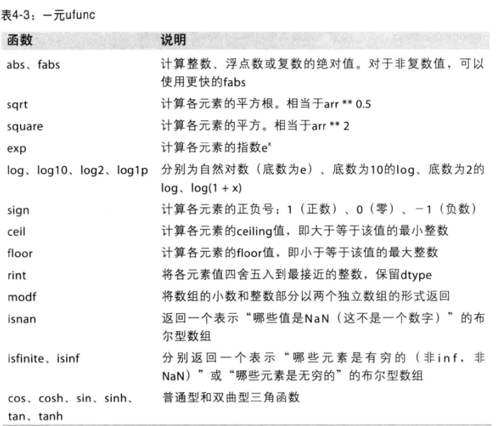
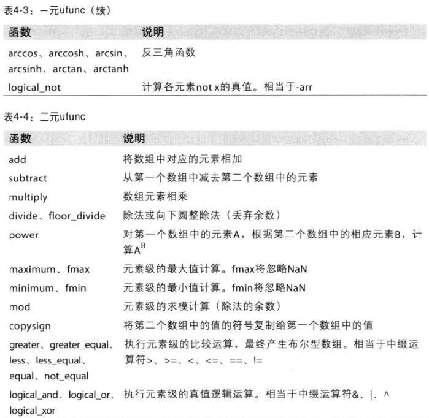
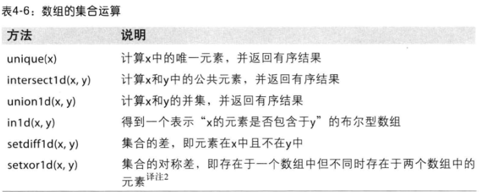
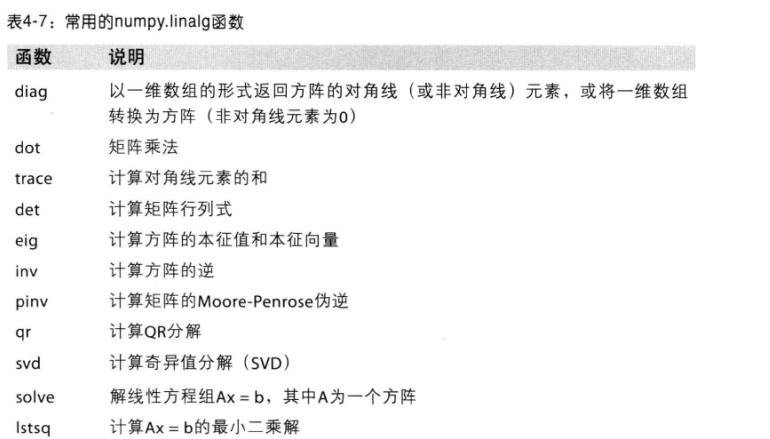
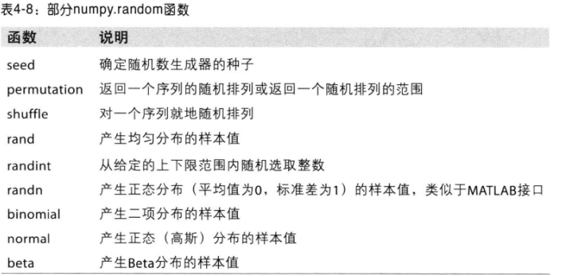
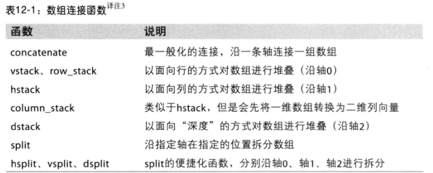

## python 基础

### Anaconda 安装

* [下载地址](https://www.continuum.io/downloads)

* 命令行创建和启动

  `conda create --name py27 python=2.7`

  `activate py27`

* 列出安装的包 `conda list` `conda list -n py27`

* 安装新包 `conda install numpy` （会安装和更新库所依赖的各种库）

* 删除包 `conda remove requests`

* 更新包 `conda update numpy`

* 上述命令 可以通过 -n 指定环境，或者默认当前使用的环境

* 设置国内镜像

  ```python
  # 添加Anaconda的TUNA镜像
  conda config --add channels https://mirrors.tuna.tsinghua.edu.cn/anaconda/pkgs/free/
   
  # 设置搜索时显示通道地址
  conda config --set show_channel_urls yes
  ```

  ​

### 安装一些依赖

```python
conda install ipython
conda install jupyter
conda install numpy
conda install scipy
conda install pandas
conda install matplotlib
```

### Numpy

提供常用的数值数组、矩阵等函数

优点：

*   基于向量化的运算

*   进行数值运算时Numpy数组比list效率高

*   可以直接对数组的每个元素进行操作

    ```python
    In [1]: import numpy as np

    In [2]: np.arange(10)
    Out[2]: array([0, 1, 2, 3, 4, 5, 6, 7, 8, 9])

    In [3]: a = _

    In [4]: a ** 2
    Out[4]: array([ 0,  1,  4,  9, 16, 25, 36, 49, 64, 81])
    ```

    ​

### Scipy

是一种使用numpy来做高等数学、信号处理、优化、统计的扩展包

* Linear Algebra (scipy.linalg)  线性代数

* Statistics (scipy.stats) 统计

* Spatial data structure and algorithms (scipy.spatial) 空间的数据结构和算法

  ```python
  In [5]: from scipy import linalg

  In [6]: A = np.array([[1,2],[3,4]])

  In [7]: A
  Out[7]:
  array([[1, 2],
         [3, 4]])

  In [8]: linalg.det(A)
  Out[8]: -2.0
  ```

  ​

### Pandas

一种基于numpy的高级数据结构和精巧工具，快速简单的处理数据

数据结构：Series和DataFrame

```python
In [9]: import pandas as pd

In [10]: s = pd.Series([1,3,5,np.nan,6,8])

In [11]: s
Out[11]:
0    1.0
1    3.0
2    5.0
3    NaN
4    6.0
5    8.0
dtype: float64

In [12]: dates = pd.date_range("20170101", periods=6)

In [13]: dates
Out[13]:
DatetimeIndex(['2017-01-01', '2017-01-02', '2017-01-03', '2017-01-04',
               '2017-01-05', '2017-01-06'],
              dtype='datetime64[ns]', freq='D')

In [15]: df = pd.DataFrame(np.random.randn(6,4), index=dates, columns=list("ABCD"))

In [16]: df
Out[16]:
                   A         B         C         D
2017-01-01  0.566986  1.496505 -0.581817 -0.871785
2017-01-02 -1.124203  0.062415 -0.299159  0.196818
2017-01-03  1.487586 -0.617459  1.742232  1.907163
2017-01-04 -1.366047 -0.601547  1.337706 -1.475740
2017-01-05  1.701493  1.312726  0.394726  0.400058
2017-01-06  0.443797  0.852563  1.315806 -1.041364

In [19]: df.describe()  # 描述
Out[19]:
              A         B         C         D
count  6.000000  6.000000  6.000000  6.000000
mean   0.284935  0.417534  0.651582 -0.147475
std    1.286018  0.937085  0.958398  1.243207
min   -1.366047 -0.617459 -0.581817 -1.475740
25%   -0.732203 -0.435557 -0.125688 -0.998969
50%    0.505392  0.457489  0.855266 -0.337483
75%    1.257436  1.197685  1.332231  0.349248
max    1.701493  1.496505  1.742232  1.907163

In [20]: df.T  # 转置
Out[20]:
   2017-01-01  2017-01-02  2017-01-03  2017-01-04  2017-01-05  2017-01-06
A    0.566986   -1.124203    1.487586   -1.366047    1.701493    0.443797
B    1.496505    0.062415   -0.617459   -0.601547    1.312726    0.852563
C   -0.581817   -0.299159    1.742232    1.337706    0.394726    1.315806
D   -0.871785    0.196818    1.907163   -1.475740    0.400058   -1.041364

In [21]: df.sort_values(by="B")  # p排序
Out[21]:
                   A         B         C         D
2017-01-03  1.487586 -0.617459  1.742232  1.907163
2017-01-04 -1.366047 -0.601547  1.337706 -1.475740
2017-01-02 -1.124203  0.062415 -0.299159  0.196818
2017-01-06  0.443797  0.852563  1.315806 -1.041364
2017-01-05  1.701493  1.312726  0.394726  0.400058
2017-01-01  0.566986  1.496505 -0.581817 -0.871785
```


### matplotlib

python 的绘图库

```python
In [1]: import matplotlib.pyplot as plt

In [2]: plt.plot([1,2,3])
Out[2]: [<matplotlib.lines.Line2D at 0x68f82b0>]

In [3]: plt.ylabel("some numebers")
Out[3]: <matplotlib.text.Text at 0x67f5208>

In [4]: plt.show()
```


### nltk

自然语言处理工具包

```python
安装：pip install nltk
引入：import nltk
下载语料库： nltk.download()
```


应用：

* 文本提取
* 词汇切分
* 词频分析
* 词袋模型
* 情感分析


### igraph

图计算和社交网络分析

安装：

```python
pip install -U python-igraph
conda install -c marufr python-igraph=0.7.1.post6
或者
下载 http://www.lfd.uci.edu/~gohlke/pythonlibs/#python-igraph
python_igraph-0.7.1.post6-cp27-none-win_amd64.whl
pip install python_igraph-0.7.1.post6-cp27-none-win_amd64.whl
```

### Scikit-learn

是建立在scipy之上的一个用于机器学习的python模块

安装

```python
pip install -U scikit-learn
conda install scikit-learn
```

### 练习题

找出数组numbers中的两个数，他们的和为target，返回这两个数的下标

```python
from collections import defaultdict


def get_index_tuple(alist, target):
    res = []
    for i, x in enumerate(alist):
        if x > target:
            continue
        for j, y in enumerate(alist[i:]):
            if (x + y) == target:
                index = (i, i + j)
                res.append(index)
    return res

# 将值存到hash，再遍历的时候，根据差值找
def get_index_tuple_hash(alist, target):
    res = []
    data = defaultdict(list)
    for i, x in enumerate(alist):
        data[x].append(i)
    for i, x in enumerate(alist):
        diff = target - x
        if diff in data:
            for j in data[diff]:
                if j != i:
                    res.append((i, j))
    return res

alist, target = [2, 7, 11, 7, 17], 9
print get_index_tuple(alist, target)
print get_index_tuple_hash(alist, target)
```


## Numpy

Numpy是python的一个扩展库。支持高级大量的维度与矩阵运算，此外也针对数组运算提供大量的数学函数库。

基本功能介绍：

* 快速高效的多维数组对象ndarray
* 用于对数组执行元素级计算以及直接对数组执行数学运算的函数
* 用于读写硬盘上基于数组的数据集工具
* 线性代数运算、傅里叶变换、随机数生成
* 用于将C、C++、Fortran代码集成到python的工具
* 作为算法之间的传递数据的容器


效率对比，以求和为例：

* 使用numpy.array 结构，并使用numpy.sum 函数效率最高
* 使用list和array结构的时候，使用python的sum效率要搞


### ndarry

一种N维数组对象，该对象是一个快速而灵活的大数据集容器。

每个数组都有一个shape（一个代表各维度大小的元组）和一个dtype（说明数据类型对象）

### 创建ndarray


```python
In [47]: alist = range(10)
In [48]: arr = np.array(alist); arr, arr.dtype, arr.shape
Out[48]: (array([0, 1, 2, 3, 4, 5, 6, 7, 8, 9]), dtype('int32'), (10L,))
    
In [49]: data = [[1, 2, 3, 4], [5, 6, 7, 8]]

In [50]: arr2 = np.array(data);arr2, arr2.dtype, arr2.shape
Out[50]:
(array([[1, 2, 3, 4],
        [5, 6, 7, 8]]), dtype('int32'), (2L, 4L))

In [51]: np.zeros(10)
Out[51]: array([ 0.,  0.,  0.,  0.,  0.,  0.,  0.,  0.,  0.,  0.])

In [52]: np.zeros((2,4))
Out[52]:
array([[ 0.,  0.,  0.,  0.],
       [ 0.,  0.,  0.,  0.]])

In [53]: np.empty((2,3,2))
Out[53]:
array([[[ 0.,  0.],
        [ 0.,  0.],
        [ 0.,  0.]],

       [[ 0.,  0.],
        [ 0.,  0.],
        [ 0.,  0.]]])
```

注意：np.empty 里面仅仅是占位，元素没有初始化。

### numpy的数据类型


* 创建ndarray时指定dtype类型

* 使用astype显示转换类型，astype进行了复制，原数组不变

  ```python
  In [54]: arr = np.array([1, 2, 3], dtype = np.float64); arr.dtype
  Out[54]: dtype('float64')

  In [55]: arr = np.array([1, 2, 3], dtype = np.int32); arr.dtype
  Out[55]: dtype('int32')

  In [57]: int_arr = np.array([1, 2, 3, 4, 5]); int_arr.dtype
  Out[57]: dtype('int32')

  In [58]: float_arr = int_arr.astype(np.float); float_arr.dtype
  Out[58]: dtype('float64')

  ```

  ​

### ndarray数组与标量之间的运算

* 不用编写循环即可对数据执行批量运算

* 大小相等的数组之间的任何算术运算都会将运算应用到元素级

* 数组与标量的算术运算也会将那个标量的值传播到各个元素

  ```python
  In [62]: arr = np.array([[1.0, 2.0, 3.0], [4., 5., 6.]])

  In [63]: arr * arr
  Out[63]:
  array([[  1.,   4.,   9.],
         [ 16.,  25.,  36.]])

  In [64]: arr - arr
  Out[64]:
  array([[ 0.,  0.,  0.],
         [ 0.,  0.,  0.]])

  In [65]: 1/arr
  Out[65]:
  array([[ 1.        ,  0.5       ,  0.33333333],
         [ 0.25      ,  0.2       ,  0.16666667]])

  In [67]: arr**.5
  Out[67]:
  array([[ 1.        ,  1.41421356,  1.73205081],
         [ 2.        ,  2.23606798,  2.44948974]])
  ```

  ### ndarry的索引和切片

  一维数组很简单，跟python列表类似。

  当将一个标量传递给切片时，如arr[5:8] = 12，该值会自动广播到整个选区。

  ```python
  In [73]: arr = np.arange(10)

  In [75]: arr[5], arr[5:8]
  Out[75]: (5, array([5, 6, 7]))

  In [76]: arr[5:8] = 12; arr
  Out[76]: array([ 0,  1,  2,  3,  4, 12, 12, 12,  8,  9])
  ```

  跟列表的重要区别是：**数组切片是原始数组的视图，数据不会被复制，视图的任何修改都被反应到源数组上。**如果想要复制，可以显示操作`arr[5:8].copy()`

  ```python
  In [77]: arr_slice= arr[5:8]

  In [78]: arr_slice[1] = 12345

  In [79]: arr
  Out[79]: array([    0,     1,     2,     3,     4,    12, 12345,    12,     8,   9])

  In [80]: arr_slice[:] = 64

  In [81]: arr
  Out[81]: array([ 0,  1,  2,  3,  4, 64, 64, 64,  8,  9])

  ```

  在二维数组中，各个索引位置上的元素不再是标量，而是一维数组。

  可以对元素进行递归访问，也可以逗号隔开的索引选取单个元素。

  ```python
  In [88]: arr2d = np.array([[1,2,3],[4,5,6],[7,8,9]])

  In [89]: arr2d[2]
  Out[89]: array([7, 8, 9])

  In [90]: arr2d[0][2]
  Out[90]: 3

  In [91]: arr2d[0,2]
  Out[91]: 3
  ```

  在多维数组中，如果省略了后面的索引，返回对象是一个维度低一点的ndarray

  标量值和数组都可以被赋值给arr3d[0]

  ```python
  In [94]: arr3d = np.array([[[1,2,3], [4,5,6]],[[7,8,9], [10,11,12]]])

  In [95]: arr3d
  Out[95]:
  array([[[ 1,  2,  3],
          [ 4,  5,  6]],

         [[ 7,  8,  9],
          [10, 11, 12]]])

  In [96]: arr3d[0]
  Out[96]:
  array([[1, 2, 3],
         [4, 5, 6]])

  In [97]: old_values = arr3d[0].copy()

  In [98]: arr3d[0] = 42; arr3d
  Out[98]:
  array([[[42, 42, 42],
          [42, 42, 42]],

         [[ 7,  8,  9],
          [10, 11, 12]]])

  In [99]: arr3d[0] = old_values; arr3d
  Out[99]:
  array([[[ 1,  2,  3],
          [ 4,  5,  6]],

         [[ 7,  8,  9],
          [10, 11, 12]]])

  In [100]: arr3d[1, 0]
  Out[100]: array([7, 8, 9])
  ```

  **切片索引**

  切片语法跟list这样的一维对象差不多

  高纬度对象可以在一个或者多个轴上进行切片，也可以跟整数索引混合用。

  “冒号”表示选取整个轴

  ```python
  In [101]: arr2d
  Out[101]:
  array([[1, 2, 3],
         [4, 5, 6],
         [7, 8, 9]])

  In [102]: arr2d[:2]
  Out[102]:
  array([[1, 2, 3],
         [4, 5, 6]])

  In [103]: arr2d[:2, 1:]
  Out[103]:
  array([[2, 3],
         [5, 6]])

  In [104]: arr2d[:, 1]
  Out[104]: array([2, 5, 8])

  In [105]: arr2d[:, :1]
  Out[105]:
  array([[1],
         [4],
         [7]])
  ```

  **布尔型索引**

  数组的比较运算也是矢量化的 （==   != ）

  布尔型数组可以用于数组索引，要求布尔型数组的长度必须跟被索引的轴的长度一致

  布尔型数组跟切片、整数可以混合使用

  可以组合应用多个布尔条件，使用 &(和) |（或）~(非)运算即可

  通过布尔型数组设置值是一种常用手段，如将数组中所有小于0的设置为0

  ```python
  In [107]: names = np.array(["Bob", "Joe", "Will", "Bob", "Will", "Joe", "Joe"])

  In [108]: data = np.random.randn(7, 4)

  In [109]: data
  Out[109]:
  array([[ 0.7938396 , -0.64073577,  0.39437987,  0.74264878],
         [-1.06331352,  0.15099267, -1.66302807, -1.19741409],
         [-1.35491288, -1.1184129 ,  0.67225899,  0.30427689],
         [ 1.80158574,  1.68064436, -0.59577665, -0.56495864],
         [ 0.28012105,  0.10510227, -1.83661252, -0.72791189],
         [ 1.80042063, -0.83958714, -0.983758  ,  0.80808786],
         [-2.7868147 , -1.40439205, -0.38592472, -0.50612607]])

  In [110]: names == "Bob"
  Out[110]: array([ True, False, False,  True, False, False, False], dtype=bool)

  In [111]: data[names == "Bob"]
  Out[111]:
  array([[ 0.7938396 , -0.64073577,  0.39437987,  0.74264878],
         [ 1.80158574,  1.68064436, -0.59577665, -0.56495864]])

  In [112]: data[names == "Bob", 2:]
  Out[112]:
  array([[ 0.39437987,  0.74264878],
         [-0.59577665, -0.56495864]])

  In [113]: mask = (names == "Bob") | (names == "Will")

  In [114]: data[mask]
  Out[114]:
  array([[ 0.7938396 , -0.64073577,  0.39437987,  0.74264878],
         [-1.35491288, -1.1184129 ,  0.67225899,  0.30427689],
         [ 1.80158574,  1.68064436, -0.59577665, -0.56495864],
         [ 0.28012105,  0.10510227, -1.83661252, -0.72791189]])

  In [115]: data[data < 0] = 0

  In [116]: data
  Out[116]:
  array([[ 0.7938396 ,  0.        ,  0.39437987,  0.74264878],
         [ 0.        ,  0.15099267,  0.        ,  0.        ],
         [ 0.        ,  0.        ,  0.67225899,  0.30427689],
         [ 1.80158574,  1.68064436,  0.        ,  0.        ],
         [ 0.28012105,  0.10510227,  0.        ,  0.        ],
         [ 1.80042063,  0.        ,  0.        ,  0.80808786],
         [ 0.        ,  0.        ,  0.        ,  0.        ]])
  ```

  **花式索引**

  花式索引（Fancy indexing）是指利用整数数组进行索引。

  切记：花式索引跟切片不一样，总是将数据复制到新的数组中。

  一次传入多个数组，返回的是一维数组，其中的元素对应各个索引元组。

  要选取矩阵的行列子集应该使用矩形区域的形式才可以。

  ```python
  # 一个8*4的数组
  In [117]: arr = np.empty((8,4))

  In [119]: for i in range(8):
       ...:     arr[i] = i
       ...:

  In [120]: arr
  Out[120]:
  array([[ 0.,  0.,  0.,  0.],
         [ 1.,  1.,  1.,  1.],
         [ 2.,  2.,  2.,  2.],
         [ 3.,  3.,  3.,  3.],
         [ 4.,  4.,  4.,  4.],
         [ 5.,  5.,  5.,  5.],
         [ 6.,  6.,  6.,  6.],
         [ 7.,  7.,  7.,  7.]])
  # 以特定顺序选取子集
  In [121]: arr[[4,3,0,6]]
  Out[121]:
  array([[ 4.,  4.,  4.,  4.],
         [ 3.,  3.,  3.,  3.],
         [ 0.,  0.,  0.,  0.],
         [ 6.,  6.,  6.,  6.]])

  In [123]: arr = np.arange(32).reshape((8,4))

  In [124]: arr
  Out[124]:
  array([[ 0,  1,  2,  3],
         [ 4,  5,  6,  7],
         [ 8,  9, 10, 11],
         [12, 13, 14, 15],
         [16, 17, 18, 19],
         [20, 21, 22, 23],
         [24, 25, 26, 27],
         [28, 29, 30, 31]])

  In [125]: arr[[1,5,7,2],[0,3,1,2]]  # 选取(1,0) (5,3) (7,2) (2,2)位置的元素
  Out[125]: array([ 4, 23, 29, 10])
   
  # 矩形区域方式一
  In [126]: arr[[1,5,7,2]][:,[0,3,1,2]]
  Out[126]:
  array([[ 4,  7,  5,  6],
         [20, 23, 21, 22],
         [28, 31, 29, 30],
         [ 8, 11,  9, 10]])
  # 矩形区域方式二
  In [127]: arr[np.ix_([1,5,7,2],[0,3,1,2])]
  Out[127]:
  array([[ 4,  7,  5,  6],
         [20, 23, 21, 22],
         [28, 31, 29, 30],
         [ 8, 11,  9, 10]])
  ```

  ### 数组转置和轴兑换

  转置（transpose）是重塑的一种特殊形式，它返回源数据的视图。

  数组有个特殊属性T，可以进行轴兑换

  对于高维数组，转置需要得到一个由轴编号组成的元组才能对这些轴进行转置

  ndarray还有一个swapaxes方法，它需要接受一对轴编号

  swapaxes 也是返回源数据的视图

  ```python
  In [128]: arr = np.arange(15).reshape((3,5))

  In [129]: arr
  Out[129]:
  array([[ 0,  1,  2,  3,  4],
         [ 5,  6,  7,  8,  9],
         [10, 11, 12, 13, 14]])

  # 转置
  In [130]: arr.T
  Out[130]:
  array([[ 0,  5, 10],
         [ 1,  6, 11],
         [ 2,  7, 12],
         [ 3,  8, 13],
         [ 4,  9, 14]])

  # 用np.dot 计算矩阵内积
  In [131]: np.dot(arr.T, arr)
  Out[131]:
  array([[125, 140, 155, 170, 185],
         [140, 158, 176, 194, 212],
         [155, 176, 197, 218, 239],
         [170, 194, 218, 242, 266],
         [185, 212, 239, 266, 293]])
  In [132]: arr = np.arange(16).reshape((2,2,4))

  In [133]: arr
  Out[133]:
  array([[[ 0,  1,  2,  3],
          [ 4,  5,  6,  7]],

         [[ 8,  9, 10, 11],
          [12, 13, 14, 15]]])

  # 第0个和第1个坐标互换
  # a'[x][y][z] = a[y][x][z]
  In [134]: arr.transpose((1,0,2))
  Out[134]:
  array([[[ 0,  1,  2,  3],
          [ 8,  9, 10, 11]],

         [[ 4,  5,  6,  7],
          [12, 13, 14, 15]]])

  In [136]: arr.swapaxes(1,2)
  Out[136]:
  array([[[ 0,  4],
          [ 1,  5],
          [ 2,  6],
          [ 3,  7]],

         [[ 8, 12],
          [ 9, 13],
          [10, 14],
          [11, 15]]])
  # 与arr.swapaxes(1,2)效果一样
  In [138]: arr.transpose((0,2,1))
  Out[138]:
  array([[[ 0,  4],
          [ 1,  5],
          [ 2,  6],
          [ 3,  7]],

         [[ 8, 12],
          [ 9, 13],
          [10, 14],
          [11, 15]]])
  ```

  ### 数组的重塑

  使用reshape可以重塑数组

  -1 代表自动推断维度

  ravel可以将高维数组拉平

  ```python
  In [255]: arr = np.arange(10)

  In [256]: arr.reshape((2,5))
  Out[256]:
  array([[0, 1, 2, 3, 4],
         [5, 6, 7, 8, 9]])

  In [260]: x = arr.reshape((5, -1));x
  Out[260]:
  array([[0, 1],
         [2, 3],
         [4, 5],
         [6, 7],
         [8, 9]])

  In [261]: x.ravel()
  Out[261]: array([0, 1, 2, 3, 4, 5, 6, 7, 8, 9])
  ```

  ​

  ### 通用函数：快速的元素级数组函数

  通用函数（ufunc）是一种对ndarray中的数据执行元素级运算的函数。

  许多ufunc是简单元素级变体，如sqrt、exp都是一元函数。

  另外一些，如add、maxinum接受两个数组，是二元函数，返回一个结果数组

  有些特殊函数 modf返回多个数组，它是python的divmod的矢量化变体

  ```python
  In [148]: arr = np.arange(10)

  In [149]: np.sqrt(arr)
  Out[149]:
  array([ 0.        ,  1.        ,  1.41421356,  1.73205081,  2.        ,
          2.23606798,  2.44948974,  2.64575131,  2.82842712,  3.        ])
  In [150]: x = np.random.randn(8)

  In [151]: y = np.random.randn(8)
      
  In [153]: np.maximum(x, y)
  Out[153]:
  array([ 0.51955399,  0.50244785,  1.50765635,  1.57184637, -0.07270351,
          0.70609317, -0.86336894, -0.60054656])

  In [154]: arr = np.random.randn(7)*5

  In [155]: np.modf(arr)
  Out[155]:
  (array([-0.91392983,  0.20031294, -0.22244219,  0.23778874,  0.69261585,
           0.69194927, -0.25685396]), array([-2.,  1., -3.,  8.,  2.,  0., -1.]))
  ```

  常用函数

  

  

  ### 利用数组进行数据处理

  用数组表达式代替循环的做法，通常称为矢量化。

  一般来说，矢量化数组运算比等价的纯python快一两个数量级。

  假设我们想在一组值（网格型）上计算sqrt(x^2+y^2)

  np.meshgrid函数接受两个一维数组，并产生两个二维矩阵（对应于两个数组所有的x,y对）

  ```python
  import matplotlib.pyplot as plt
  import numpy as np
  import pylab

  points = np.arange(-5, 5, 0.01) # 生成100个点
  xs, ys = np.meshgrid(points, points)  # xs, ys互为转置矩阵
  z = np.sqrt(xs ** 2 + ys ** 2)
  # 画图
  plt.imshow(z, cmap = plt.cm.gray);
  plt.colorbar()
  plt.title("Image plot of $\sqrt{x^2 + y^2}$ for a grid of values")
  pylab.show() 
  ```

  ### 将条件逻辑表述为数组运算

  假设有两个数组，根据cond的值选取x_arr和y_arr的值：Truex选x_arr的值，否则取y_arr

  我们可以用列表推导式来实现，但速度慢，无法处理多维数组。

  np.where实现很快速简洁。

  np.where 第二个和第三个参数不必是数组，他们可以是标量

  ```python
  In [172]: x_arr = np.array([1.1, 1.2, 1.3, 1.4, 1.5])

  In [173]: y_arr = np.array([2.1, 2.2, 2.3, 2.4, 2.5])

  In [174]: cond = np.array([True, False, True, True, False])

  # 列表表达式来实现
  In [175]: result = [(x if c else y) for x, y, c in zip(x_arr, y_arr, cond)]

  In [176]: result
  Out[176]: [1.1000000000000001, 2.2000000000000002, 1.3, 1.3999999999999999, 2.5]
  # 用np.where实现
  In [177]: np.where(cond, x_arr, y_arr)
  Out[177]: array([ 1.1,  2.2,  1.3,  1.4,  2.5])

  In [178]: arr = np.random.randn(4,4)
  # 矢 量
  In [179]: np.where(arr>0, 2, -2)
  Out[179]:
  array([[ 2, -2, -2,  2],
         [ 2, -2, -2,  2],
         [ 2,  2, -2,  2],
         [-2, -2,  2,  2]])
  # 矢量标量 混用
  In [180]: np.where(arr>0, 2, arr)
  Out[180]:
  array([[ 2.        , -0.75104522, -0.31914459,  2.        ],
         [ 2.        , -0.90266597, -0.28003433,  2.        ],
         [ 2.        ,  2.        , -0.17544682,  2.        ],
         [-0.57475715, -0.36938037,  2.        ,  2.        ]])
  ```

  ### 数学和统计方法

  可以通过数组上的一组数学函数对整个数组或者某个轴向的数据进行统计计算。

  mean、sum既可以当做数组的实例方法，也可以做顶级NumPy函数调用

  mean、sum这类函数可以接受一个axis参数（计算该轴的统计值），最终结果是少一维的数组

  ```python
  In [184]: arr = np.random.randn(5, 4)

  In [185]: arr.mean()
  Out[185]: -0.26580636498671667

  In [186]: np.mean(arr)
  Out[186]: -0.26580636498671667

  In [187]: arr.sum()
  Out[187]: -5.3161272997343332
  ```

  ​


### 用于布尔型数组的方法

```python
In [188]: arr = np.random.randn(100)

In [189]: (arr>0).sum()
Out[189]: 48

In [190]: bools = np.array([False, False, True, False])

In [191]: bools.any()
Out[191]: True

In [192]: bools.all()
Out[192]: False
```

### 排序

类似于列表可以用sort排序

多维数组可以在任何一个轴上进行排序，只需要将轴编号传递给sort

顶级方法np.sort 返回的是数组的已排序副本，而就地排序会修改数组本身。

```python
In [197]: arr = np.random.randn(8); arr
Out[197]:
array([ 0.5985591 ,  0.28215617, -0.46345863, -0.92394897, -0.620585  ,
        0.76634099,  0.18505155,  1.16513665])

In [198]: arr.sort();arr
Out[198]:
array([-0.92394897, -0.620585  , -0.46345863,  0.18505155,  0.28215617,
        0.5985591 ,  0.76634099,  1.16513665])

In [199]: arr = np.random.randn(5,3);arr
Out[199]:
array([[-0.48963625, -1.0665124 , -0.22732483],
       [-0.45045068,  1.90308559,  0.4284296 ],
       [ 0.06221939, -0.50142336, -1.51828131],
       [-0.09930601, -0.31250197,  2.26411946],
       [ 0.36338618,  0.65231805,  1.77791779]])

In [200]: arr.sort(1);arr
Out[200]:
array([[-1.0665124 , -0.48963625, -0.22732483],
       [-0.45045068,  0.4284296 ,  1.90308559],
       [-1.51828131, -0.50142336,  0.06221939],
       [-0.31250197, -0.09930601,  2.26411946],
       [ 0.36338618,  0.65231805,  1.77791779]])
# 选取5%分位数
In [201]: large_arr = np.random.randn(1000)

In [202]: large_arr.sort()

In [203]: large_arr[int(0.05*len(large_arr))]
Out[203]: -1.6525932091555453
```

### 唯一化以及其他集合逻辑

找出数组唯一值，并返回排序的结果

```python
In [204]: names = np.array(["Bob", "Joe", "Will", "Bob", "Will", "Joe", "Joe"])

In [205]: np.unique(names)
Out[205]:
array(['Bob', 'Joe', 'Will'],
      dtype='|S4')

# 等价的python代码
In [206]: sorted(set(names))
Out[206]: ['Bob', 'Joe', 'Will']

# 测试一个数组中的值在另一个数组中的成员资格，返回布尔类型数组np.in1d
In [207]: values = np.array([6,0,0,3,2,5,6])

In [208]: np.in1d(values, [2,3,6])
Out[208]: array([ True, False, False,  True,  True, False,  True], dtype=bool)
```



### 数组文件的输入输出

NumPy能够读写磁盘上的文本数据或者二进制数据。

np.save和np.load是读写磁盘数组数据的两个函数。

默认情况下，数组以未压缩的原始二进制格式保存在扩展名为.npy的文件中。

```python
In [209]: arr = np.arange(10)

# 默认会自动加上.npy后缀
In [210]: np.save("some_array", arr)

In [211]: np.load("some_array.npy")
Out[211]: array([0, 1, 2, 3, 4, 5, 6, 7, 8, 9])

In [212]: arr2 = np.arange(20)

# 将多个数组保存在一个压缩文件中
In [213]: np.savez("array_archive.npz", a=arr, b=arr2)

In [214]: arch = np.load("array_archive.npz")

In [215]: arch["b"]
Out[215]:
array([ 0,  1,  2,  3,  4,  5,  6,  7,  8,  9, 10, 11, 12, 13, 14, 15, 16,
       17, 18, 19])
```

### 线性代数

```python
In [216]: x = np.array([[1.,2.,3.],[4.,5.,6.]])

In [217]: y = np.array([[6.,23.], [-1,7], [8,9]])

In [218]: x.dot(y)
Out[218]:
array([[  28.,   64.],
       [  67.,  181.]])

# 与上面x.dot(y)等价
In [219]: np.dot(x,y)
Out[219]:
array([[  28.,   64.],
       [  67.,  181.]])
# 一个二维数组跟一个大小合适的一维数组的矩阵点积运算之后得到一个一维数组
In [220]: np.dot(x, np.ones(3))
Out[220]: array([  6.,  15.])
    
In [263]: from numpy.linalg import inv, qr

In [265]: X = np.random.randn(5,5)

In [266]: mat = X.T.dot(X) # 

In [268]: inv(mat)  # 矩阵求逆
 
In [269]: mat.dot(inv(mat))  # 与逆矩阵相乘，得到单位矩阵
    
In [270]: q,r=qr(mat)  # 矩阵消元
    
# 求解线性方程
In [353]: a = np.array([[3,1], [1,2]])

In [354]: b = np.array([9,8])

In [355]: x = np.linalg.solve(a, b);x
Out[355]: array([ 2.,  3.])
```



### 随机数生成

numpy.random模块对python内置的random进行了补充，增加了一些高效的生成概率分布的样本值函数。

```python
# normal得到一个4*4标准正态分布的数组
In [221]: samples = np.random.normal(size=(4,4))

In [222]: samples
Out[222]:
array([[-1.13988434, -1.09063543, -1.1260231 , -0.72939203],
       [-0.17765671, -0.59351777, -1.7025208 ,  1.29316625],
       [-0.48208534,  1.44957156,  0.15657483, -0.1689305 ],
       [-0.843992  , -0.2221633 ,  0.32601053,  0.9355808 ]])
```

如果需要大量样本值，numpy.random比内置python的random快不止一个数量级

```python
In [223]: from random import normalvariate

In [224]: N = 1000000

In [225]: %timeit samples = [normalvariate(0,1) for _ in xrange(N)]
1 loop, best of 3: 1.07 s per loop

In [226]: %timeit np.random.normal(size=N)
10 loops, best of 3: 46.3 ms per loop
```




### 范例：随机漫步

从0开始，步长1和-1出现的概率相等。

使用python的random实现

```python
import random
position = 0
walk = [position]
steps = 1000
for i in xrange(steps):
    step = 1 if random.randint(0, 1) else -1
    position += step
    walk.append(position)
```

使用np.random实现，并统计最大、最小值

```python
nsteps = 1000
draws = np.random.randint(0, 2, size=nsteps)
steps = np.where(draws > 0, 1, -1)
walk = steps.cumsum()

In [245]: walk.min()
Out[245]: -18

In [246]: walk.max()
Out[246]: 9
    
# 首次穿越时间，第一次穿越5的时间，用argmax来解决，返回的是布尔型数组第一个最大值的索引。
In [250]: (np.abs(walk) >= 5).argmax()
Out[250]: 6
```

一次模拟多个随机漫步，使用np.random很容易实现

```python
nwalks = 5000
nsteps = 1000
# size改为二维数组
draws = np.random.randint(0, 2, size=(nwalks, nsteps))
steps = np.where(draws > 0, 1, -1)
# 在nsteps上连续求和
walks = steps.cumsum(1)
```

也可以使用其他方式进行随机漫步

`steps = np.random.normal(loc=0, scale=0.25, size=(nwalks, nsteps))`


## numpy高级应用

### ndarray对象的内部机理

ndarray内部有以下内容组成：

* 一个指向数组（一个系统内存块）的指针

* 数据类型或者dtype

* 一个表示数组形状的元组shape

* 一个跨度元组stride，其中的整数是为了前进到当前维度下一个元组跨过的字节数

  ```python
  In [277]: np.ones((10, 5)).shape
  Out[277]: (10L, 5L)

  # float64 8个字节
  In [278]: np.ones((3,4,5), dtype=np.float64).strides
  Out[278]: (160L, 40L, 8L)
  ```

### Numpy数据类型体系

dtype都有一个超类，如np.integer和np.floating ，可以用np.issubdtype判断某个dtype的大类

调用dtype的mro方法可以查看其所有的父类

```python
In [279]: ints = np.ones(10, dtype=np.uint16)

In [280]: floats = np.ones(10, dtype=np.float32)

In [281]: np.issubdtype(ints.dtype, np.integer)
Out[281]: True

In [282]: np.issubdtype(floats.dtype, np.floating)
Out[282]: True

In [283]: np.float64.mro()
Out[283]:
[numpy.float64,
 numpy.floating,
 numpy.inexact,
 numpy.number,
 numpy.generic,
 float,
 object]
```


### 高级数组操作

#### 数组重塑

数组就可以从一个形状换为另一个形状reshape

多维数组也可以被重塑

参数形状的其中一维可以是-1，大小由数据本身推断而来

将多维数组扁平化可以使用ravel函数或者flatten函数

```python
In [300]: arr = np.arange(8)

In [301]: arr.reshape(2,4)
Out[301]:
array([[0, 1, 2, 3],
       [4, 5, 6, 7]])

In [303]: x = arr.reshape(2,4).reshape(4,2);x
Out[303]:
array([[0, 1],
       [2, 3],
       [4, 5],
       [6, 7]])

In [304]: x.ravel()
Out[304]: array([0, 1, 2, 3, 4, 5, 6, 7])

In [305]: x.flatten()
Out[305]: array([0, 1, 2, 3, 4, 5, 6, 7])
```

#### C和Fortran顺序

默认numpy按照行优先顺序创建的。

由于一些历史原因，行和列优先顺序被称为C和Fortran顺序

reshape和ravel这样的函数，都可以接受一个表示数组数据存放顺序的order参数

一般可以为“C”或者"F"，

C 行优先顺序，先经过更高的维度

F 列优先顺序，后经过更高的维度

```python
In [306]: arr = np.arange(12).reshape(3, 4);arr
Out[306]:
array([[ 0,  1,  2,  3],
       [ 4,  5,  6,  7],
       [ 8,  9, 10, 11]])

In [307]: arr.ravel()
Out[307]: array([ 0,  1,  2,  3,  4,  5,  6,  7,  8,  9, 10, 11])

In [308]: arr.ravel("F")
Out[308]: array([ 0,  4,  8,  1,  5,  9,  2,  6, 10,  3,  7, 11])
```


#### 数组的合并与拆分

numpy.concatenate可以按指定轴将一个由数组组成的序列连接到一起

对于常见的连接操作，提供方便的方法如vstack和hstack

与此相反，split用于将一个数组沿指定轴拆分多个数组

```python
In [309]: arr1 = np.array([[1,2,3], [4,5,6]])

In [310]: arr2 = np.array([[7,8,9], [10,11,12]])

In [311]: np.concatenate([arr1, arr2], axis=0)
Out[311]:
array([[ 1,  2,  3],
       [ 4,  5,  6],
       [ 7,  8,  9],
       [10, 11, 12]])

In [312]: np.concatenate([arr1, arr2], axis=1)
Out[312]:
array([[ 1,  2,  3,  7,  8,  9],
       [ 4,  5,  6, 10, 11, 12]])

In [313]: np.vstack((arr1, arr2))
Out[313]:
array([[ 1,  2,  3],
       [ 4,  5,  6],
       [ 7,  8,  9],
       [10, 11, 12]])

In [314]: np.hstack((arr1, arr2))
Out[314]:
array([[ 1,  2,  3,  7,  8,  9],
       [ 4,  5,  6, 10, 11, 12]])

# 拆分
In [315]: arr = np.random.randn(5,2)

In [316]: first, second, third = np.split(arr, [1, 3])

In [317]: first
Out[317]: array([[-1.68862163, -0.29558488]])

In [318]: second
Out[318]:
array([[-0.71770707, -0.01751418],
       [-0.29260512, -1.83388987]])

In [319]: third
Out[319]:
array([[-0.36007427,  0.2707731 ],
       [-0.29187332, -2.33325893]])

In [320]: arr
Out[320]:
array([[-1.68862163, -0.29558488],
       [-0.71770707, -0.01751418],
       [-0.29260512, -1.83388987],
       [-0.36007427,  0.2707731 ],
       [-0.29187332, -2.33325893]])
```



#### 堆叠辅助类：r_ 和 c_

```python
n [321]: arr = np.arange(6)

n [323]: arr1 = arr.reshape((3,2));arr1
ut[323]:
rray([[0, 1],
      [2, 3],
      [4, 5]])

n [324]: arr2 = np.random.randn(3,2);arr2
ut[324]:
rray([[-0.89965995,  0.75989696],
      [-2.18478745, -0.8094043 ],
      [-0.25806042,  0.45517876]])

n [325]: np.r_[arr1, arr2]
ut[325]:
rray([[ 0.        ,  1.        ],
      [ 2.        ,  3.        ],
      [ 4.        ,  5.        ],
      [-0.89965995,  0.75989696],
      [-2.18478745, -0.8094043 ],
      [-0.25806042,  0.45517876]])

n [326]: np.c_[np.r_[arr1, arr2], arr]
ut[326]:
rray([[ 0.        ,  1.        ,  0.        ],
      [ 2.        ,  3.        ,  1.        ],
      [ 4.        ,  5.        ,  2.        ],
      [-0.89965995,  0.75989696,  3.        ],
      [-2.18478745, -0.8094043 ,  4.        ],
      [-0.25806042,  0.45517876,  5.        ]])

# 将切片翻译为数组
In [327]: np.c_[1:6, -10:-5]
Out[327]:
array([[  1, -10],
       [  2,  -9],
       [  3,  -8],
       [  4,  -7],
       [  5,  -6]])
```

#### 元组的重复操作：tile和repeat

对数组进行重复以产生更大数组的工具主要是tile和repeat

repeat会将数组中的各个元素重复一定次数，以产生更大数组，如果传入参数是整数，每个元素都重复多次，传入参数是数组则可以重复不同次数

```python
In [328]: arr = np.arange(3)

In [329]: arr.repeat(3)
Out[329]: array([0, 0, 0, 1, 1, 1, 2, 2, 2])

In [330]: arr.repeat([2,3,4])
Out[330]: array([0, 0, 1, 1, 1, 2, 2, 2, 2])
```

tile的功能是沿着指定轴向堆叠数组的副本。铺瓷砖

第二个参数是瓷砖的数量。对于标量，瓷砖是水平铺设的，也可以是个铺设布局的数组

```python
In [336]: arr = np.random.randn(2,2);arr
Out[336]:
array([[-0.5002626 ,  0.56851365],
       [-0.58827299, -0.11653661]])

In [337]: np.tile(arr, 2)
Out[337]:
array([[-0.5002626 ,  0.56851365, -0.5002626 ,  0.56851365],
       [-0.58827299, -0.11653661, -0.58827299, -0.11653661]])

In [338]: np.tile(arr, (2, 1))
Out[338]:
array([[-0.5002626 ,  0.56851365],
       [-0.58827299, -0.11653661],
       [-0.5002626 ,  0.56851365],
       [-0.58827299, -0.11653661]])

In [339]: np.tile(arr, (3, 2))
Out[339]:
array([[-0.5002626 ,  0.56851365, -0.5002626 ,  0.56851365],
       [-0.58827299, -0.11653661, -0.58827299, -0.11653661],
       [-0.5002626 ,  0.56851365, -0.5002626 ,  0.56851365],
       [-0.58827299, -0.11653661, -0.58827299, -0.11653661],
       [-0.5002626 ,  0.56851365, -0.5002626 ,  0.56851365],
       [-0.58827299, -0.11653661, -0.58827299, -0.11653661]])
```

#### 花式索引等价函数：take和put

```python
# 花式索引
In [340]: arr = np.arange(10)*100

In [341]: inds = [7,1,2,6]

In [342]: arr[inds]
Out[342]: array([700, 100, 200, 600])

# 使用take
In [343]: arr.take(inds)
Out[343]: array([700, 100, 200, 600])
   
# put修改数据
In [344]: arr.put(inds, [40,41,42,43])

In [345]: arr
Out[345]: array([  0,  41,  42, 300, 400, 500,  43,  40, 800, 900])
    
# 如果要在其他轴使用take，传入axis关键字即可
In [346]: inds = [2,0,2,1]

In [347]: arr = np.random.randn(2,4);arr
Out[347]:
array([[ 0.07588051, -1.01561382, -0.19948325,  0.44012657],
       [-0.78562444, -0.37231004, -0.49968266, -1.22410441]])

In [348]: arr.take(inds, axis=1)
Out[348]:
array([[-0.19948325,  0.07588051, -0.19948325, -1.01561382],
       [-0.49968266, -0.78562444, -0.49968266, -0.37231004]])
```

### TODO


